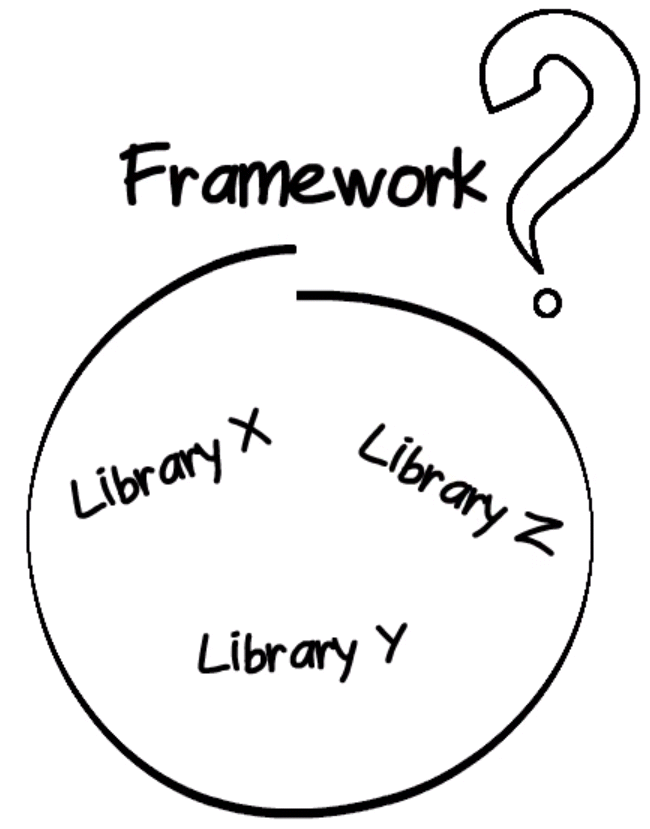
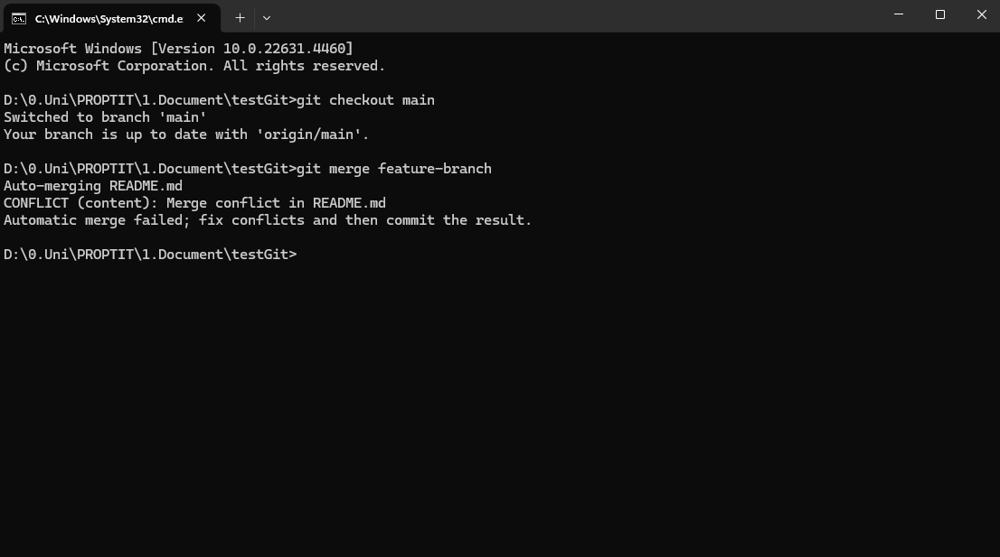
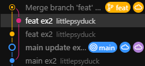
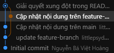
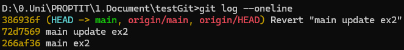
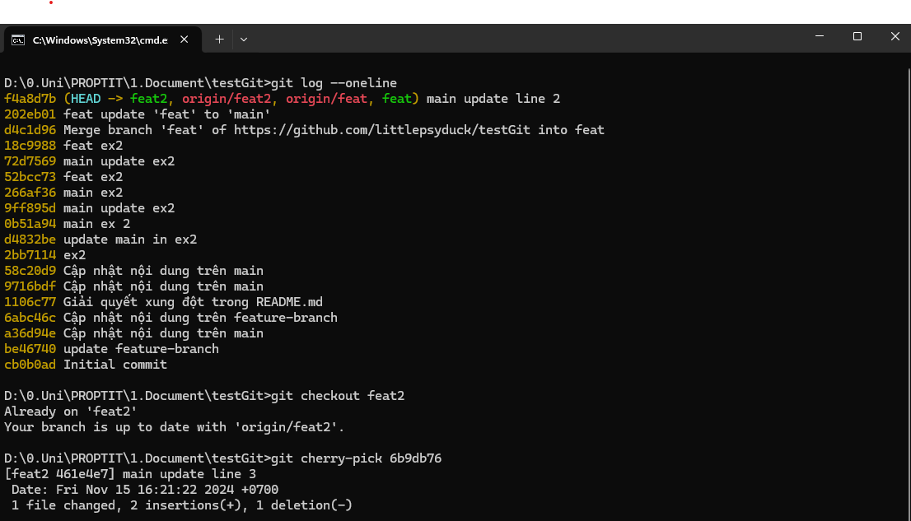
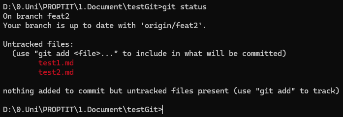

:memo: <span style="color:orange">FLUTTER_001_FLUTTER_OVERVIEW_&_GIT_NÂNG_CAO</span>

# FLUTTER OVERVIEW & GIT NÂNG CAO


## Table of Content

- [FLUTTER OVERVIEW \& GIT NÂNG CAO](#flutter-overview--git-nâng-cao)
  - [Table of Content](#table-of-content)
  - [I. Flutter overview](#i-flutter-overview)
    - [1. Flutter là gì?](#1-flutter-là-gì)
    - [2. Một số đặc điểm chính](#2-một-số-đặc-điểm-chính)
      - [1. Trải nghiệm người dùng tuyệt vời](#1-trải-nghiệm-người-dùng-tuyệt-vời)
      - [2. Fast results](#2-fast-results)
      - [3. Phát triển hiệu quả cao](#3-phát-triển-hiệu-quả-cao)
      - [4. Mô hình mở và có thể mở rộng](#4-mô-hình-mở-và-có-thể-mở-rộng)
    - [3. Tại sao lại có flutter?](#3-tại-sao-lại-có-flutter)
  - [II. Framework và Library](#ii-framework-và-library)
    - [1. Framework](#1-framework)
    - [2. Library](#2-library)
    - [3. So sánh](#3-so-sánh)
  - [III. React Native](#iii-react-native)
    - [1. Giới thiệu](#1-giới-thiệu)
    - [2. So sánh](#2-so-sánh)
  - [IV. Git nâng cao](#iv-git-nâng-cao)
    - [1. Merge](#1-merge)
    - [2. Rebase](#2-rebase)
    - [3. Revert](#3-revert)
    - [4. Cherry pick](#4-cherry-pick)
    - [5. Gitignore](#5-gitignore)

## I. Flutter overview

### 1. Flutter là gì?

> Flutter là một framework phát triển ứng dụng mã nguồn mở do Google phát triển, dùng để xây dựng giao diện người dùng (UI) cho các ứng dụng di động, web, và desktop từ một codebase duy nhất.

- Nó sử dụng ngôn ngữ lập trình Dart, cũng do Google phát triển, giúp tối ưu hóa cho hiệu năng và dễ dàng triển khai đa nền tảng.

### 2. Một số đặc điểm chính

#### 1. Trải nghiệm người dùng tuyệt vời

- Flutter bao gồm một bộ widgets đầy đủ, mang đến trải nghiệm hoàn hảo dù đang xây dựng cho iOS [Cupertino](https://docs.flutter.dev/ui/widgets/cupertino) hay các nền tảng khác [Material](https://docs.flutter.dev/ui/widgets/material), cùng với hỗ trợ tùy chỉnh hoặc tạo các thành phần trực quan hoàn toàn mới.


#### 2. Fast results

- Flutter rất nhanh.
- Nó được hỗ trợ bởi các thư viện đồ họa 2D như Skia (hỗ trợ Chrome và Android) và Impeller.
- Sử dụng Dart, cho phép biên dịch thành mã máy ARM 32 bit và 64 bit cho iOS và Android, JavaScript và WebAssembly cho web, cũng như Intel x64 và ARM cho thiết bị máy tính để bàn.


#### 3. Phát triển hiệu quả cao

- Flutter cung cấp tính năng [stateful hot reload](https://docs.flutter.dev/tools/hot-reload), cho phép thực hiện các thay đổi đối với mã của mình và xem kết quả ngay lập tức mà không cần khởi động lại ứng dụng hoặc mất trạng thái.

#### 4. Mô hình mở và có thể mở rộng

- Flutter hoạt động với bất kỳ công cụ phát triển nào: Visual Studio Code và IntelliJ / Android Studio.
- Flutter là một dự án mã nguồn mở hoàn toàn.

:bulb: Code base là tổng hợp tất cả các tệp mã nguồn, thư viện, công cụ và tài liệu cần thiết để phát triển, triển khai và duy trì một ứng dụng hoặc phần mềm.

- Nó bao gồm:
  - Mã nguồn chính: Các tệp chứa mã lệnh của ứng dụng.
  - Thư viện và framework: Các công cụ hỗ trợ giúp việc phát triển phần mềm hiệu quả hơn.
  - Tài liệu: Hướng dẫn sử dụng, tài liệu thiết kế và các tài liệu liên quan.
  - Công cụ xây dựng và triển khai: Các script và công cụ cần thiết để biên dịch và triển khai phần mềm.

### 3. Tại sao lại có flutter?


- Một trong những lợi ích của Flutter là nó đơn giản.
- Flutter giải quyết được một số thách thức chính trong việc xây dựng ứng dụng đa nền tảng, đặc biệt là trong việc tạo ra các ứng dụng có giao diện đẹp, mượt mà và nhất quán trên nhiều thiết bị và hệ điều hành.

## II. Framework và Library

### 1. Framework

> Framework là một khung làm việc hoặc bộ công cụ giúp lập trình viên phát triển ứng dụng một cách có tổ chức và hiệu quả.

- Nó không chỉ cung cấp các hàm và phương thức mà còn định nghĩa luồng điều khiển và cấu trúc tổng thể của ứng dụng. Khi sử dụng framework, lập trình viên phải tuân theo các quy tắc và cấu trúc mà framework đề ra.

### 2. Library

> Library là một tập hợp các hàm, phương thức hoặc đoạn mã được xây dựng sẵn, nhằm thực hiện các nhiệm vụ cụ thể và có thể được tái sử dụng trong nhiều ứng dụng khác nhau.

### 3. So sánh



- Framework và Library đều cung cấp các tính năng (functions) được viết sẵn để chúng ta có thể tái sử dụng.

| So sánh  |Framework | Library|
|---|---|---|
| Cách hoạt động  | Framework hoạt động **chủ động**. Nghĩa là nó có thể đưa ra các quyết định gọi hoặc bị gọi bởi các Library hay ứng dụng nào đó.  |  Library hoạt động **bị động**. Nghĩa là nó chỉ được gọi khi nào chúng ta cần dùng nó. |
|Cấu trúc|Framework có thể hiểu là một khung chương trình, người dùng bổ sung code và tuân theo quy tắc để tạo ra ứng dụng.|Library chỉ cung cấp các chức năng tiện ích hay các class để sử dụng trong quá trình xây dựng ứng dụng.|
|Tính linh hoạt| Phải thay đổi cấu trúc code của dự án theo các quy tắc của framework đó để có thể sử dụng được các functions mà framework đó cung cấp.|Sử dụng các functions của Library một cách trực tiếp mà không cần thay đổi cấu trúc code của dự án.|

## III. React Native

- React Native và Flutter là hai framework phổ biến để phát triển ứng dụng di động đa nền tảng.

### 1. Giới thiệu

> React Native là một framework mã nguồn mở được phát triển bởi Facebook.

- Sử dụng JavaScript, cùng với React, một thư viện frontend của JavaScript để phát triển ứng dụng di động.

### 2. So sánh

| Tiêu chí            | React Native                        | Flutter                           |
| ------------------- | ----------------------------------- | --------------------------------- |
| **Ngôn ngữ**        | **JavaScript**                          | **Dart**                              |
| **Giao diện người dùng** | Sử dụng các thành phần **UI native** của từng nền tảng, điều này có thể dẫn đến sự không nhất quán giữa các nền tảng khác nhau. Giao diện người dùng tùy biến mạnh mẽ nhờ sử dụng CSS.          | Sử dụng **engine đồ họa riêng** để vẽ UI, giúp giảm thiểu sự khác biệt giữa các nền tảng. Styling khác biệt với CSS nhưng cung cấp nhiều tùy chọn tùy chỉnh và dễ sử dụng sau khi làm quen.             |
| **Tính năng**            | React Native yêu cầu **sử dụng nhiều thư viện cộng đồng** để bổ sung các tính năng như UI, quản lý trạng thái, và localization. Môi trường và công cụ phức tạp hơn, nhưng cộng đồng hỗ trợ lớn. | Flutter **cung cấp rất nhiều tính năng từ đầu**, bao gồm Material Design, Cupertino components, và các công cụ phát triển tiên tiến. Có thể phát triển ứng dụng mà không cần đến thư viện bên thứ ba.   |
| **Hiệu suất**            | **Hiệu suất tốt** nhưng có thể bị ảnh hưởng khi xử lý các tác vụ phức tạp do phải thông qua JavaScript Bridge. Không thích hợp cho các ứng dụng yêu cầu đồ họa cao.                             | **Hiệu suất vượt trội hơn nhờ vào engine riêng**, cung cấp trải nghiệm người dùng mượt mà và hỗ trợ tốt cho các animation phức tạp. Tuy nhiên, tiêu thụ bộ nhớ có thể cao hơn so với ứng dụng native.   |
| **Hot Reload**      | **Có**                                  | **Có**                                |
| **Đa nền tảng**     | **iOS, Android** (web, desktop hạn chế) | **iOS, Android, web, desktop** đầy đủ |

## IV. Git nâng cao

### 1. Merge

- Dùng để kết hợp thay đổi từ một nhánh khác vào nhánh hiện tại.

```bash
git merge <branch-name>
```

- Giải quyết xung đột: Nếu có xung đột (conflicts), Git sẽ yêu cầu bạn chỉnh sửa thủ công và thêm commit sau khi giải quyết xong.
- Ví dụ:
  - File .md ở nhánh main có nội dung: testGit
  - File .md ở nhánh feature-branch có nội dung: "Nội dung mới từ feature-branch".
  - Thay đổi nội dung ở nhánh main thành: "Nội dung thay đổi từ main".
- Ta được kết quả:



```bash
<<<<<<< HEAD
Nội dung thay đổi từ main
=======
Nội dung mới từ feature-branch
>>>>>>> feature-branch
```

- Giải quyết xung đột và add, commit lại.

### 2. Rebase

- Rebase di chuyển các commit từ nhánh này sang nhánh khác bằng cách thay đổi lịch sử commit.
- Thường được sử dụng để giữ lịch sử commit gọn gàng và tuyến tính.


```bash
git rebase <branch-name>
```

- Chú ý:
  - Không rebase các nhánh đã được chia sẻ với người khác.
  - Sau khi rebase, bạn cần dùng git push --force để cập nhật.



- So với merge:



### 3. Revert

- Dùng để hoàn tác một commit cụ thể mà không làm thay đổi lịch sử commit.
- Tạo ra một commit mới để đảo ngược thay đổi.

```bash
git revert <commit-hash>
```

- Hoàn tác commit gần nhất:

```bash
git revert HEAD
```



### 4. Cherry pick

- Dùng để chọn một hoặc nhiều commit từ nhánh khác và áp dụng chúng vào nhánh hiện tại.
- Hữu ích khi bạn chỉ muốn áp dụng một số thay đổi cụ thể.

```bash
git cherry-pick <commit-hash>
```

- Áp dụng commit `abc123` vào nhánh hiện tại:

```bash
git cherry-pick abc123
```



- `git log --oneline`: xem lịch sử commit của nhánh.
- Nhánh `feat2` đã được update từ 2 line lên 3 line.

### 5. Gitignore

- File .gitignore được dùng để chỉ định các tệp hoặc thư mục mà bạn không muốn Git theo dõi.
- Thường dùng để bỏ qua các tệp tạm thời, tệp cấu hình máy cục bộ hoặc các thư mục như node_modules/, build/.

```bash
# Ignore node_modules folder
node_modules/

# Ignore all log files
*.log

# Ignore specific file
config/local_config.yml
```

- Thêm 2 file mới vào `feat2`:



- Tạo file `.gitignore` trong `feat2`.
- Trong cmd sử dụng lệnh `echo test2.md >> .gitignore` để bỏ qua file này.
- Kiểm tra lại:


- Nếu file đã được tracked trước đó, cần xóa khỏi trạng thái: `git rm --cached "test2.md\"`.
