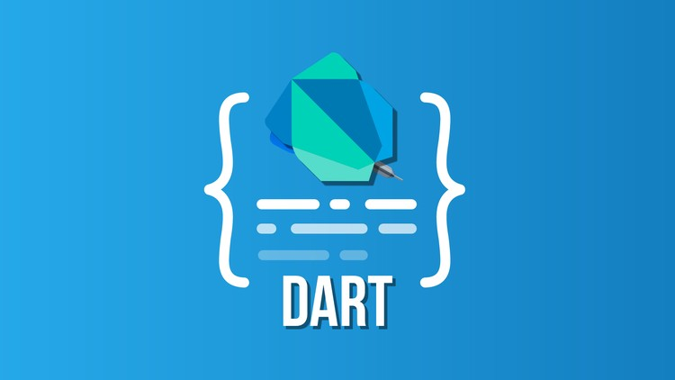

:memo: <span style="color:orange">FLUTTER_002_BIẾN_VÀ_HÀM_VÀ_CLASS_VÀ_OOP_TRONG_DART</span>

# BIẾN & HÀM & CLASS & OOP TRONG DART



## Table of Content

- [BIẾN \& HÀM \& CLASS \& OOP TRONG DART](#biến--hàm--class--oop-trong-dart)
  - [Table of Content](#table-of-content)
  - [I. Biến và kiểu dữ liệu](#i-biến-và-kiểu-dữ-liệu)
    - [1. Biến](#1-biến)
      - [1. var](#1-var)
      - [2. dynamic](#2-dynamic)
      - [3. final](#3-final)
      - [4. const](#4-const)
    - [2. Kiểu dữ liệu](#2-kiểu-dữ-liệu)
      - [1. Số int, double](#1-số-int-double)
      - [2. Chuỗi `String`](#2-chuỗi-string)
      - [3. Danh sách `List`](#3-danh-sách-list)
  - [II. Nullable](#ii-nullable)
    - [1. Nullable vs. non-nullable types](#1-nullable-vs-non-nullable-types)
    - [2. Null-aware operators](#2-null-aware-operators)
      - [If-null operator (??)](#if-null-operator-)
      - [Null-aware assignment operator (??=)](#null-aware-assignment-operator-)
      - [Null-aware access operator (?.)](#null-aware-access-operator-)
      - [Null assertion operator (!)](#null-assertion-operator-)
      - [Null-aware index operator (?\[\])](#null-aware-index-operator-)
      - [3. Null Safety với Collections](#3-null-safety-với-collections)
  - [III. Hàm và các kiểu truyền tham số](#iii-hàm-và-các-kiểu-truyền-tham-số)
    - [1. Required Positional Parameters (Tham số vị trí bắt buộc)](#1-required-positional-parameters-tham-số-vị-trí-bắt-buộc)
    - [2. Optional Positional Parameters (Tham số vị trí tùy chọn)](#2-optional-positional-parameters-tham-số-vị-trí-tùy-chọn)
    - [3. Named Parameters (Tham số đặt tên)](#3-named-parameters-tham-số-đặt-tên)
    - [4. Required Named Parameters (Tham số đặt tên bắt buộc)](#4-required-named-parameters-tham-số-đặt-tên-bắt-buộc)
    - [5. Default Parameters (Tham số mặc định)](#5-default-parameters-tham-số-mặc-định)
    - [6. Anonymous Functions (Hàm ẩn danh)](#6-anonymous-functions-hàm-ẩn-danh)
    - [7. Optional types](#7-optional-types)
    - [8. Returning a function](#8-returning-a-function)
    - [9. Closures and scope](#9-closures-and-scope)
    - [10. Arrow functions](#10-arrow-functions)
  - [IV. Tìm hiểu về bất đồng bộ](#iv-tìm-hiểu-về-bất-đồng-bộ)
    - [1. Khái niệm cơ bản](#1-khái-niệm-cơ-bản)
    - [2. Future](#2-future)
      - [2.1 `Future` là gì?](#21-future-là-gì)
      - [2.2 Chi tiết trạng thái của Future](#22-chi-tiết-trạng-thái-của-future)
      - [2.3. Hoàn thành với giá trị (Completing with a value)](#23-hoàn-thành-với-giá-trị-completing-with-a-value)
      - [2.4 Hoàn thành với lỗi (Completing with an error)](#24-hoàn-thành-với-lỗi-completing-with-an-error)
    - [3. Working with futures: async and await](#3-working-with-futures-async-and-await)
      - [Chuyển đổi hàm main() từ đồng bộ sang bất đồng bộ](#chuyển-đổi-hàm-main-từ-đồng-bộ-sang-bất-đồng-bộ)
      - [So sánh giữa hàm đồng bộ và bất đồng bộ](#so-sánh-giữa-hàm-đồng-bộ-và-bất-đồng-bộ)
    - [4. Future và phương thức then](#4-future-và-phương-thức-then)
    - [5. Asynchronous programming: Streams](#5-asynchronous-programming-streams)
  - [V. Class](#v-class)
    - [1. Giới thiệu về Class](#1-giới-thiệu-về-class)
    - [2. Fields (Thuộc tính)](#2-fields-thuộc-tính)
    - [3. Constructors (Hàm tạo)](#3-constructors-hàm-tạo)
      - [a. Default Constructor](#a-default-constructor)
      - [b. Named Constructor](#b-named-constructor)
      - [c. Redirecting Constructor](#c-redirecting-constructor)
      - [d. Factory Constructor](#d-factory-constructor)
    - [4. Methods (Phương thức)](#4-methods-phương-thức)
      - [Getter và Setter](#getter-và-setter)
    - [5. Inheritance (Kế thừa)](#5-inheritance-kế-thừa)
    - [6. Abstract Classes](#6-abstract-classes)
    - [7. Extension Methods](#7-extension-methods)
  - [VI. With, Mixin](#vi-with-mixin)
    - [1.  Cách sử dụng Mixins](#1--cách-sử-dụng-mixins)
    - [2. Định nghĩa một Mixin](#2-định-nghĩa-một-mixin)
    - [3. Đảm bảo các thành viên cần thiết trong mixin](#3-đảm-bảo-các-thành-viên-cần-thiết-trong-mixin)
    - [4. Sử dụng từ khóa `on` để giới hạn lớp cha](#4-sử-dụng-từ-khóa-on-để-giới-hạn-lớp-cha)
    - [5. class, mixin, or mixin class?](#5-class-mixin-or-mixin-class)
  - [VII. 4 tính chất oop](#vii-4-tính-chất-oop)
    - [1. Tính đóng gói (Encapsulation):](#1-tính-đóng-gói-encapsulation)
    - [2. Abstraction (Trừu tượng)](#2-abstraction-trừu-tượng)
    - [3. Inheritance (Kế thừa)](#3-inheritance-kế-thừa)
    - [4. Polymorphism (Đa hình)](#4-polymorphism-đa-hình)

## I. Biến và kiểu dữ liệu

### 1. Biến

#### 1. var

- `var` là từ khóa để khai báo biến với kiểu suy luận tự động. Dart sẽ tự động xác định kiểu dữ liệu của biến dựa trên giá trị đầu tiên được gán.
- Sau khi gán giá trị ban đầu, kiểu dữ liệu của biến không thể thay đổi.
- Ví dụ:

```dart
void main() {
  var name = 'John'; // Dart tự hiểu đây là kiểu String
  print(name); // Output: John

  // name = 123; // Lỗi: không thể gán kiểu int cho biến String
}
```

- Nếu không khởi tạo giá trị ban đầu, biến có kiểu dynamic mặc định.

#### 2. dynamic

- `dynamic` cho phép biến nhận bất kỳ kiểu dữ liệu nào và thay đổi kiểu dữ liệu trong runtime.
- Dùng khi bạn không biết trước kiểu dữ liệu hoặc cần xử lý các kiểu dữ liệu khác nhau.
- Ví dụ:

```dart
void main() {
  dynamic data = 'Hello'; // Lúc đầu là String
  print(data); // Output: Hello

  data = 42; // Sau đó đổi thành int
  print(data); // Output: 42
}
```

- Ưu điểm: Linh hoạt khi xử lý các giá trị không xác định trước kiểu.
- Nhược điểm: Dễ dẫn đến lỗi runtime, khó phát hiện lỗi sớm, khó bảo trì mã.
- Khuyến nghị: Chỉ nên sử dụng `dynamic` khi cần thiết, và luôn kiểm tra kiểu dữ liệu trước khi thực hiện các thao tác.

#### 3. final

- `final` được sử dụng khi bạn muốn gán giá trị cho biến một lần duy nhất.
- Giá trị có thể được xác định tại runtime (thời điểm chạy chương trình).
- Biến final không thể thay đổi sau khi được gán.
- Ví dụ:

```dart
void main() {
  final name = 'Alice';
  print(name); // Output: Alice

  // name = 'Bob'; // Lỗi: Không thể thay đổi giá trị của final

  final currentTime = DateTime.now(); // Giá trị được xác định tại runtime
  print(currentTime);
}
```

#### 4. const

- `const` tương tự như final, nhưng giá trị của const phải được xác định tại compile-time (thời điểm biên dịch).
- const thường được sử dụng để khai báo các giá trị bất biến và không phụ thuộc vào runtime.
- Ví dụ:

```dart
void main() {
  const pi = 3.14; // Giá trị phải xác định tại compile-time
  print(pi); // Output: 3.14

  // const currentTime = DateTime.now(); // Lỗi: Không thể dùng DateTime.now() với const
}
```

| Thuộc tính  | final  |const|
|---|---|---|
| Thay đổi giá trị  | Không được thay đổi sau khi gán  | Không được thay đổi sau khi gán  |
| Xác định giá trị | Xác định tại runtime hoặc compile-time  | Bắt buộc xác định tại compile-time  |
| Dùng cho đối tượng  |  Đối tượng có thể biến đổi nội dung (mutable) | Đối tượng không thể biến đổi nội dung|

```dart
void main() {
  final list1 = [1, 2, 3];
  list1[0] = 42; // Hợp lệ: nội dung có thể thay đổi
  print(list1); // Output: [42, 2, 3]

  const list2 = [1, 2, 3];
  // list2[0] = 42; // Lỗi: không thể thay đổi nội dung
}

```

### 2. Kiểu dữ liệu

#### 1. Số int, double

- `int`
  - Đại diện cho số nguyên (không có phần thập phân).
  - Ví dụ: 0, 42, -100.
- `double`
  - Đại diện cho số thực (có phần thập phân).
  - Ví dụ: 3.14, -0.5, 1.0.

```dart
void main() {
  int age = 25;
  double pi = 3.14;

  print('Tuổi: $age'); // Output: Tuổi: 25
  print('Số pi: $pi'); // Output: Số pi: 3.14
}
```

#### 2. Chuỗi `String`

- Dùng để lưu trữ chuỗi ký tự.
- Có thể dùng dấu nháy đơn ', nháy kép " hoặc chuỗi đa dòng với ''' hoặc """.
- Có thể nối chuỗi bằng ký tự $.

```dart
void main() {
  String name = 'Alice';
  String multiLine = '''
  Đây là chuỗi
  nhiều dòng.
  ''';

  print(name); // Output: Alice
  print(multiLine);
}
```

#### 3. Danh sách `List`

- Là kiểu dữ liệu tương tự mảng, chứa danh sách các phần tử.
- Danh sách `động`: Có thể thêm hoặc xóa phần tử.
- Danh sách `cố định` (const): Không thể thay đổi phần tử sau khi tạo.

```dart
void main() {
  // Danh sách cố định (fixed-length list)
  List<int> fixedList = List.filled(3, 0); // Danh sách cố định với 3 phần tử
  fixedList[0] = 10;
  fixedList[1] = 20;
  fixedList[2] = 30;
  print("Danh sách cố định: $fixedList");
  // Không thể thêm hoặc xóa phần tử
  // fixedList.add(40); // Lỗi: Unsupported operation: add

  // Danh sách động (growable list)
  List<int> growableList = []; // Danh sách động
  growableList.add(10);
  growableList.add(20);
  growableList.add(30);
  print("Danh sách động: $growableList");
  growableList.add(40); // Có thể thêm phần tử
  print("Sau khi thêm phần tử: $growableList");
}
```

## II. Nullable

- Trước Dart 2.0
  - Trước phiên bản 2.0, Dart là ngôn ngữ nullability. Theo đó, null sẽ là kiểu con (subtype) của mọi kiểu. Tức là tất cả các kiểu số nguyên int, số thực double, danh sách List… đều chấp nhận giá trị null.
- Dart 2.0
  - Từ phiên bản 2.0 thì Dart là ngôn ngữ hỗ trợ null safety. Theo đó, kiểu Null đã tách ra, không còn là kiểu con của các kiểu khác nữa. Do đó, khi bạn khai báo một biến là non-nullable (ví dụ kiểu int, kiểu String) mà lại gán cho chúng giá trị null thì chương trình sẽ báo lỗi.
  
### 1. Nullable vs. non-nullable types

- Đối với Dart, các kiểu dữ liệu thì mặc định sẽ là non-nullable. Có nghĩa là phải cung cấp giá trị cho nó lúc khai báo và không bao giờ chứa giá trị `null`.
- Kiểu Nullable là kiểu ngoài chứa giá trị của nó ra, thì còn cho phép chứa giá trị `null`. Có nghĩa là nó cho phép việc vắng mặt giá trị. 
- Cú pháp khai báo là thêm dấu `?` vào sau kiểu dữ liệu.
- Mọi kiểu non-nullable trong Dart đều có kiểu nullable tương ứng. Ngoài ra, với kiểu nullable khi khai báo các đối tượng thì không cần cung cấp giá trị ban đầu cho nó. Mặc định nếu sẽ hiểu là đống tượng sẽ có giá trị là null. 
- `late`: Biến có thể là nullable nhưng được đảm bảo sẽ được khởi tạo sau, giúp tránh phải sử dụng ? trong trường hợp chắc chắn rằng nó sẽ không null sau khi được khởi tạo.

### 2. Null-aware operators

- Tóm tắt như sau:
  - If-null operator (??)
  - Null-aware assignment operator (??=)
  - Null-aware access operator (?.)
  - Null-aware method invocation operator (?.)
  - Null assertion operator (!)
  - Null-aware cascade operator (?..)
  - Null-aware index operator (?[])
  - Null-aware spread operator (…?)

#### If-null operator (??)

```dart
object ?? value
```

- Nếu như đối tượng là null thì sẽ lấy giá trị bên phải dấu ?? . Còn nếu như giá trị đối tượng khác null thì sẽ lấy giá trị của đối tượng.

```dart
String? name;
final text = name ?? 'unknow';
print(text); //unknow
```

#### Null-aware assignment operator (??=)

```dart
double? size;
//size = size ?? 20.0;
size ??= 30.0;
print(size);
```

#### Null-aware access operator (?.)

```dart
int? age;
print(age?.isNegative); //null
```

- Toán tử truy cập để nhận biết đổi tượng đang là null hay không.

#### Null assertion operator (!)

- Dùng `!` để để chỉ định rõ ràng rằng một giá trị nullable không phải là null tại thời điểm sử dụng.
- Nếu giá trị thực sự là null, sẽ xảy ra lỗi `Null check operator used on a null value` khi chạy chương trình.

``` dart
void main() {
  String? name; // name có thể là null

  // Sử dụng toán tử ! để khẳng định name không null
  name = "Alice";
  print(name!.length); // Được phép vì name không null, Output: 5

  // Nếu name là null, chương trình sẽ gặp lỗi
  name = null;
  // print(name!.length); // Lỗi: Null check operator used on a null value
}
```  

#### Null-aware index operator (?[])

```dart
List<int>? myList = [1, 2, 3, 4];
print(myList[3]);
```

- Toán tử ?[] dùng để truy cập vào các phân tử trong một danh sách List nếu danh sách đó là nullable.

```dart
myList = null;
print(myList?[3]);
```

#### 3. Null Safety với Collections

- Dart hỗ trợ nullable cho mọi kiểu dữ liệu như List, Map, Set, v.v.

```dart
void main() {
  List<int>? numbers;  // Nullable list
  numbers = [1, 2, 3];
  print(numbers);  // Output: [1, 2, 3]

  Map<String, int>? scores;  // Nullable Map
  scores = {"Alice": 90, "Bob": 80};
  print(scores);  // Output: {Alice: 90, Bob: 80}
}

```

## III. Hàm và các kiểu truyền tham số

```dart
String hello(String name) {
  return 'Hello. I am $name';
}
```

- Trong đó:
  - Return Type: đó là phần đầu tiên trong dòng khai báo function. Trong ví dụ là kiểu String
  - Function Name: là tên function, phần tiếp theo sau Return Type. Trong ví dụ tên function là hello
  - Parameters: là các tham số cho function, có thể có 1 hoặc nhiều tham số, hoặc không có tham số nào hết. Chúng được khai báo trong dấu (). Chia thành 2 phần:
    - Parameter Type: kiểu của tham số (phần từ trước)
    - Parameter Name: là tên của tham số (phần tử sau)
  - Return Value: giá trị mà function trả về, nó sẽ được gửi trong lệnh return ở bên trong function
  - Function body: toàn bộ các dòng lệnh trong 2 dấu { }

- Gọi hàm:

```dart
void main() {
  var str = hello("Fx Studio");
  print(str);
}
```

### 1. Required Positional Parameters (Tham số vị trí bắt buộc)

- Đây là các tham số `bắt buộc` phải được truyền khi gọi hàm.
- Thứ tự truyền tham số `phải đúng` với thứ tự định nghĩa.

```dart
void greet(String name, int age) {
  print('Hello $name, you are $age years old.');
}
void main(){
  greet('Alice', 25);
}
```

### 2. Optional Positional Parameters (Tham số vị trí tùy chọn)

- Các tham số này được đặt trong dấu ngoặc vuông `[]`.

- Không bắt buộc phải truyền khi gọi hàm. Nếu không truyền, chúng nhận giá trị `null` (hoặc giá trị mặc định nếu được chỉ định).

``` dart
String fullName(String first, String last, [String? title]) {
  if (title != null) {
    return '$title $first $last';
  } else {
    return '$first $last';
  }
}
```

- `title` là tham số tuỳ chọn.

```dart
print(fullName('Fx', 'Studio'));

print(fullName('Albert', 'Einstein', 'Professor'));
```

### 3. Named Parameters (Tham số đặt tên)

- Các tham số được đặt trong dấu ngoặc nhọn `{}`.
- Chúng có:
  - tên khi gọi hàm, làm cho ý nghĩa của các tham số được rõ ràng hơn
  - có thể optional để bỏ qua giá trị, tức là null
  - có giá trị mặc định, được gán sau dấu = của mỗi tham số

```dart
bool withinTolerance(int value, {int min = 0, int max = 10}) {
  return min <= value && value <= max;
}

withinTolerance(9, min: 7, max: 11);
```

### 4. Required Named Parameters (Tham số đặt tên bắt buộc)

- Để bắt buộc một tham số đặt tên, bạn thêm từ khóa `required`.
- Điều này đảm bảo rằng người gọi hàm phải truyền giá trị cho tham số đó.

```dart
bool withinTolerance2({required int value, required int min, required int max}) {
  return min <= value && value <= max;
}
```

- Sẽ có suggestion từ các IDE.
- Lưu ý, với từ khoá required thì sẽ không dùng được giá trị mặc định cho tham số.

### 5. Default Parameters (Tham số mặc định)

- Có thể gán giá trị mặc định cho tham số, áp dụng cho cả `optional positional` và `optional named parameters`.
- Nếu không truyền tham số, giá trị mặc định sẽ được sử dụng.

```dart
String fullName2(String first, String last, [String title = 'Ahihi']) {
  return '$title $first $last';
}

print(fullName2('Fx', 'Studio'));

print(fullName2('Albert', 'Einstein', 'Professor'));
```

- Với cách cung cấp Default Values thì sẽ loại trừ đi các trường hợp null của các Parameters optional.

### 6. Anonymous Functions (Hàm ẩn danh)

- Đây là các hàm không có tên.
- Ý nghĩa
  - Biến 1 function thành một biến hay khai báo 1 biến với kiểu dữ liệu là 1 function
  - Khai báo các tham số của một function là một kiểu function
  - Return giá trị trả về là một function

```dart
([[Type] param1[, …]]) {
  codeBlock;
};
```

- Trong đó:
  - Các tham số ở trong dấu ()
  - Code sẽ ở trong 2 dấu {}
  - Kiểu trả về tuỳ thuộc vào giá trị return của function này

```dart
final multiply = (int a, int b) {
  return a * b;
};
```

- Lúc này, multiply được xem là một biến. Tuy nhiên, kiểu dữ liệu của nó là một function và giá trị trả về tuỳ thuộc vào giá trị tham số truyền vào.

```dart
print(multiply(2, 3));
```

### 7. Optional types

- Được xem là một tính năng đặc biệt của functions trong Dart. Bạn có thể lượt bỏ đi phần Return Type trong khai báo function.

``` dart
compliment(number) {
  return '$number is a very nice number.';
}
```

- Với khai báo function như trên, Dart sẽ hiểu kiểu trả về của function là một kiểu dạng dynamic. Mặc dù, Dart có thể suy luận ra kiểu trả về là String bên trong hàm.
- Ngoài ra, với khai báo kiểu này, bạn có thể bỏ qua cả kiểu dữ liệu của tham số.

### 8. Returning a function

- 1 function return về một function.

```dart
Function applyMultiplier(num multiplier) {
  return (num value) {
    return value * multiplier;
  };
}
```

- Trong đó, Function ở đầu tiên được xem là một kiểu dữ liệu cho function applyMultiplier. Và kết quả trả về của applyMultiplier lại là 1 hàm ẩn danh.

```dart
final triple = applyMultiplier(3);
print(triple(6));
print(triple(14.0));
```

- Lúc này, triple vẫn là 1 biến với kiểu là applyMultiplier. Chúng ta không thực thi được triple ngay lúc này. Mà nó vẫn là chỉ là function mà thôi.
- Vì hàm ẩn danh trong phần return lại cần 1 tham số nữa. Do đó, khi gọi biến này thực thi, bạn lại cung cấp thêm cho chúng 1 đối số tiếp.

### 9. Closures and scope

- Khi biến được khai báo ở ngoài bao đóng, thì hàm ẩn danh vẫn có thể truy cập và thay đổi giá trị của biến từ bên trong. Và ta gọi thực thi nhiều lần, thì đối tượng tác động chính là biến khai báo ở ngoài đó.

```dart
var counter = 0;
final incrementCounter = () {
  counter += 1;
};

incrementCounter();
incrementCounter();
incrementCounter();
incrementCounter();
incrementCounter();
print(counter); //5
```

### 10. Arrow functions

```dart
int add(int a, int b) {
   return a + b; 
}

int add(int a, int b) => a + b;

numbers.forEach((number) {
  final tripled = number * 4;
  print(tripled);
});

numbers.forEach((number) => print(number * 4));
```

## IV. Tìm hiểu về bất đồng bộ

[Asynchronous](https://dart.dev/libraries/async/async-await)

- `Asynchronous operation` (Hoạt động bất đồng bộ): Sau khi bắt đầu, cho phép các hoạt động khác thực thi trước khi hoàn thành.

- `Asynchronous function` (Hàm bất đồng bộ): Thực hiện ít nhất một hoạt động bất đồng bộ và có thể thực hiện các hoạt động đồng bộ.
### 1. Khái niệm cơ bản


`Bất đồng bộ` trong Dart được sử dụng để xử lý các tác vụ cần thời gian thực hiện dài (như đọc/ghi tệp, gọi API, xử lý dữ liệu lớn). Mục tiêu là không để chương trình bị chặn trong khi chờ tác vụ hoàn tất.

Dart hỗ trợ lập trình bất đồng bộ thông qua:

- `Future`: Đại diện cho một giá trị hoặc lỗi sẽ sẵn sàng trong tương lai.
- `Stream:` Đại diện cho một chuỗi các giá trị bất đồng bộ.
- Từ khóa `async` và `await`: Giúp mã bất đồng bộ trông giống đồng bộ hơn.
- Phương thức `then()`: Xử lý kết quả khi một Future hoàn thành.


**Tại sao mã bất đồng bộ quan trọng?**

Các hoạt động bất đồng bộ cho phép chương trình của bạn tiếp tục thực hiện các tác vụ khác trong khi chờ một tác vụ dài hoàn thành. Một số ví dụ phổ biến về các hoạt động bất đồng bộ bao gồm:

- **Lấy dữ liệu qua mạng** (Fetching data over a network).
- **Ghi dữ liệu vào cơ sở dữ liệu** (Writing to a database).
- **Đọc dữ liệu từ tệp** (Reading data from a file).

**Kết quả của các tác vụ bất đồng bộ**

- Những tính toán bất đồng bộ này thường trả về kết quả dưới dạng một `Future` nếu chỉ có một kết quả.

- Nếu có nhiều kết quả (ví dụ như một chuỗi các sự kiện), chúng sẽ được trả về dưới dạng `Stream`.

Ví dụ: Sử dụng hàm bất đồng bộ không đúng cách
```dart
String createOrderMessage() {
  var order = fetchUserOrder();
  return 'Your order is: $order';
}

Future<String> fetchUserOrder() =>
    // Giả sử đây là một hàm phức tạp và chậm.
    Future.delayed(
      const Duration(seconds: 2),
      () => 'Large Latte',
    );

void main() {
  print('Fetching user order...');
  print(createOrderMessage());
}
```

Vấn đề trong ví dụ:

- `fetchUserOrder()` là một hàm bất đồng bộ: Sau một khoảng trễ, nó cung cấp một chuỗi mô tả đơn hàng của người dùng ("Large Latte").
- `createOrderMessage()` không chờ đợi: Hàm này gọi `fetchUserOrder()` nhưng không đợi kết quả trả về.
- Kết quả không mong muốn: Thay vì in `"Large Latte"`, chương trình in `"Your order is: Instance of '_Future<String>'"`, tức là một Future chưa hoàn thành.

### 2. Future

#### 2.1 `Future` là gì?

- Một `future` (chữ thường) là một instance của lớp `Future` (chữ in hoa) trong Dart.
- Một `future` đại diện cho kết quả của một hoạt động bất đồng bộ và có thể tồn tại trong hai trạng thái:
  - **Chưa hoàn thành (Uncompleted)**: Khi hoạt động chưa kết thúc.
  - **Đã hoàn thành (Completed)**: Khi hoạt động hoàn thành với:
    - Một giá trị (nếu thành công).
    - Một lỗi (nếu thất bại).

#### 2.2 Chi tiết trạng thái của Future

**Chưa hoàn thành (Uncompleted)**

Khi bạn gọi một hàm bất đồng bộ, hàm trả về một `future` ở trạng thái **chưa hoàn thành**.

Trong trạng thái này, `future` đang chờ:
- Hoạt động bất đồng bộ hoàn tất.
- Hoặc ném ra lỗi.

**Đã hoàn thành (Completed)**

Khi hoạt động bất đồng bộ hoàn tất, `future` chuyển sang **trạng thái đã hoàn thành**:

- Hoàn thành với **giá trị**: Nếu hoạt động thành công.
- Hoàn thành với **lỗi**: Nếu hoạt động thất bại.

#### 2.3. Hoàn thành với giá trị (Completing with a value)

Một `future` có kiểu `Future<T>` hoàn thành với một giá trị thuộc kiểu `T`.
- Ví dụ: `Future<String>` sẽ trả về một giá trị kiểu `String`.

Nếu `future` không trả về giá trị, kiểu của nó sẽ là `Future<void>`.

```dart
Future<void> fetchUserOrder() {
  return Future.delayed(
    const Duration(seconds: 2),
    () => print('Large Latte'),
  );
}

void main() {
  print('Fetching user order...');
  fetchUserOrder();
}
```

```
Fetching user order...
Large Latte
```

*- Hoạt động bất đồng bộ bị trì hoãn bởi `Future.delayed.`*

*- Trong thời gian đó, các lệnh khác tiếp tục thực thi.*

#### 2.4 Hoàn thành với lỗi (Completing with an error)

Khi hoạt động bất đồng bộ thất bại, `future` hoàn thành với một `lỗi`.

```dart
Future<void> fetchUserOrder() {
  return Future.delayed(
    const Duration(seconds: 2),
    () => throw 'Invalid user ID',
  );
}

void main() {
  print('Fetching user order...');
  fetchUserOrder();
}
```

### 3. Working with futures: async and await

Các từ khóa `async` và `await` trong Dart cung cấp một cách khai báo rõ ràng để định nghĩa các hàm bất đồng bộ (asynchronous functions) và xử lý kết quả của chúng.

**Nguyên tắc chính:**
-  Để định nghĩa một hàm bất đồng bộ, thêm từ khóa `async` trước thân hàm.
-  Từ khóa `await` chỉ có thể sử dụng trong các hàm được đánh dấu với `async`.


#### Chuyển đổi hàm main() từ đồng bộ sang bất đồng bộ

1. Thêm từ khóa `async` trước thân hàm:

```dart
void main() async { ··· }
```

2. Nếu hàm có kiểu trả về đã được khai báo, cập nhật kiểu trả về thành `Future<T>`, trong đó `T` là kiểu giá trị mà hàm trả về. Nếu hàm không trả về giá trị cụ thể, kiểu trả về sẽ là `Future<void>`:

```dart
Future<void> main() async { ··· }
```
3. Khi đã có hàm bất đồng bộ, sử dụng từ khóa `await` để chờ một future hoàn thành:

```dart
print(await createOrderMessage());
```

#### So sánh giữa hàm đồng bộ và bất đồng bộ

**Hàm đồng bộ**

```dart
String createOrderMessage() {
  var order = fetchUserOrder();
  return 'Your order is: $order';
}

Future<String> fetchUserOrder() =>
    Future.delayed(
      const Duration(seconds: 2),
      () => 'Large Latte',
    );

void main() {
  print('Fetching user order...');
  print(createOrderMessage());
}
```

```vbnet
Fetching user order...
Your order is: Instance of 'Future<String>'
```

*`fetchUserOrder()` là một asynchronous function, nhưng `createOrderMessage()` không chờ nó hoàn thành. Do đó, thay vì nhận giá trị `"Large Latte"`, chương trình in ra một `Future` chưa hoàn thành.*


**Hàm bất đồng bộ**

```dart
Future<String> createOrderMessage() async {
  var order = await fetchUserOrder();
  return 'Your order is: $order';
}

Future<String> fetchUserOrder() =>
    Future.delayed(
      const Duration(seconds: 2),
      () => 'Large Latte',
    );

Future<void> main() async {
  print('Fetching user order...');
  print(await createOrderMessage());
}
```

```vbnet
Fetching user order...
Your order is: Large Latte
```

**Sự khác biệt giữa hai ví dụ:**

**1. Kiểu trả về thay đổi:**

- `createOrderMessage()` thay đổi kiểu trả về từ `String` thành `Future<String>`.

**2. Thêm từ khóa `async`:**

- Thêm `async` trước thân hàm `createOrderMessage()` và `main()`.

**3. Sử dụng từ khóa await:**

- Thêm `await` để chờ kết quả từ `fetchUserOrder()` và `createOrderMessage()`.

**Các thuật ngữ quan trọng**

- **`async`**: Từ khóa dùng để khai báo một asynchronous function.

- **Asynchronous function**: Một hàm được đánh dấu với từ khóa **`async`**.

- **`await`**: Từ khóa dùng để nhận kết quả hoàn thành từ một biểu thức bất đồng bộ. Từ khóa này chỉ hoạt động trong các hàm **`async`**.

**Ví dụ: Luồng thực thi bên trong hàm async**

```dart
Future<void> printOrderMessage() async {
  print('Awaiting user order...');
  var order = await fetchUserOrder();
  print('Your order is: $order');
}

Future<String> fetchUserOrder() {
  // Giả sử hàm này phức tạp và chậm.
  return Future.delayed(const Duration(seconds: 4), () => 'Large Latte');
}

void main() async {
  countSeconds(4);
  await printOrderMessage();
}

// Hàm hỗ trợ - hiển thị bộ đếm thời gian để minh họa độ trễ.
void countSeconds(int s) {
  for (var i = 1; i <= s; i++) {
    Future.delayed(Duration(seconds: i), () => print(i));
  }
}
```

```sql
Awaiting user order...
1
2
3
4
Your order is: Large Latte
```

- Một `async function` chạy đồng bộ cho đến khi gặp lệnh `await`.
- Sau lệnh `await`, luồng thực thi tạm dừng để đợi kết quả từ `Future`.
- Phần còn lại của chương trình vẫn chạy song song nếu không bị tạm dừng bởi `await`.
- Kết quả sẽ xuất hiện theo trình tự thực thi được chỉ định trong code.

### 4. Future và phương thức then

[then](https://dart.dev/libraries/async/futures-error-handling)

Trong Dart, phương thức `then` được sử dụng để đăng ký các callback sẽ được gọi khi một `Future` hoàn thành. Khi một Future hoàn thành với một giá trị, callback `onValue` sẽ được gọi với giá trị đó. 

Nếu `Future` hoàn thành với lỗi và callback `onError` được cung cấp, `onError` sẽ được gọi với lỗi và stack trace tương ứng.

**Tham số:**
- **`onValue`**: Callback được gọi khi **`Future`** hoàn thành với một giá trị.
- **`onError`** *(tùy chọn)*: Callback được gọi khi **`Future`** hoàn thành với lỗi.

**Lưu ý:**
- Nếu **`onError`** không được cung cấp và **`Future`** hoàn thành với lỗi, lỗi sẽ được chuyển tiếp trực tiếp đến **`Future`** được trả về bởi **`then`**.
- Nếu callback trả về một **`Future`**, **`Future`** được trả về bởi **`then`** sẽ hoàn thành với cùng kết quả như **`Future`** được trả về bởi callback.
- Nếu callback ném ra một ngoại lệ, **`Future`** được trả về bởi **`then`** sẽ hoàn thành với lỗi đó và stack trace tương ứng.


**Cú pháp**

```dart
Future<R> then<R>(
  FutureOr<R> onValue(T value), {
  Function? onError,
});
```

```dart
Future<int> fetchData() {
  // Giả sử đây là một thao tác bất đồng bộ
  return Future.delayed(Duration(seconds: 2), () => 42);
}

void main() {
  fetchData().then((value) {
    print('Giá trị nhận được: $value');
  }).catchError((error) {
    print('Đã xảy ra lỗi: $error');
  });
}
```

Trong ví dụ này, `fetchData()` trả về một `Future<int>`. Phương thức `then` được sử dụng để xử lý giá trị khi `Future` hoàn thành. Nếu có lỗi xảy ra, `catchError` sẽ xử lý lỗi đó.


### 5. Asynchronous programming: Streams

Trong Dart, `Stream` là một chuỗi dữ liệu bất đồng bộ, cho phép bạn xử lý các sự kiện hoặc dữ liệu xuất hiện theo thời gian. 

`Streams` hữu ích khi làm việc với các sự kiện người dùng, dữ liệu đọc từ tệp hoặc phản hồi từ mạng.

**Các loại Stream:**
1. **Single-subscription Stream:** Chỉ cho phép một listener đăng ký lắng nghe. Thường được sử dụng cho các thao tác I/O như đọc tệp hoặc nhận phản hồi HTTP.

2. **Broadcast Stream:** Cho phép nhiều listener cùng đăng ký lắng nghe. Thường được sử dụng cho các sự kiện như nhấn nút hoặc thay đổi dữ liệu.

**Sử dụng Stream:**

- **Lắng nghe Stream:** Sử dụng phương thức `listen` để đăng ký một callback xử lý mỗi sự kiện khi nó xuất hiện.

```dart
import 'dart:async';

void main() {
  Stream<int> stream = Stream.fromIterable([1, 2, 3]);
  
  // Lắng nghe Stream
  stream.listen((value) {
    print('Giá trị nhận được: $value');
  }, onDone: () {
    print('Stream đã hoàn thành.');
  });
}
```

```
Giá trị nhận được: 1
Giá trị nhận được: 2
Giá trị nhận được: 3
Stream đã hoàn thành.
```

- Sử dụng `await for`: Trong một hàm `async`, bạn có thể sử dụng `await for`để lặp qua các sự kiện của Stream.

```dart
import 'dart:async';

void main() async {
  Stream<int> stream = Stream.fromIterable([1, 2, 3]);
  
  // Lặp qua Stream
  await for (var value in stream) {
    print('Giá trị nhận được: $value');
  }
  print('Stream đã hoàn thành.');
}
```
```
Giá trị nhận được: 1
Giá trị nhận được: 2
Giá trị nhận được: 3
Stream đã hoàn thành.
```

**Xử lý lỗi trong Stream:**

Streams có thể phát ra các sự kiện lỗi. Bạn có thể xử lý chúng bằng cách cung cấp một callback `onError` trong phương thức `listen` hoặc sử dụng khối `try-catch` với `await for`.

```dart
stream.listen(
  (value) {
    print(value);
  },
  onError: (error) {
    print('Đã xảy ra lỗi: $error');
  },
);
```
**Tạo Stream:**

Sử dụng `StreamController`: Cho phép bạn tạo và quản lý một `Stream`.


```dart
import 'dart:async';

void main() {
  final controller = StreamController<int>();

  // Đăng ký lắng nghe Stream
  controller.stream.listen((value) {
    print('Nhận giá trị: $value');
  }, onDone: () {
    print('Stream đã đóng.');
  });

  // Thêm giá trị vào Stream
  controller.sink.add(1);
  controller.sink.add(2);
  controller.sink.add(3);

  // Đóng Stream
  controller.close();
}
```

```
Nhận giá trị: 1
Nhận giá trị: 2
Nhận giá trị: 3
Stream đã đóng.
```

Sử dụng hàm `async*` và từ khóa `yield`: Cho phép bạn tạo một Stream bằng cách phát ra các sự kiện tuần tự.

```dart
Stream<int> numberStream() async* {
  for (int i = 1; i <= 3; i++) {
    yield i; // Phát ra từng giá trị
    await Future.delayed(Duration(seconds: 1)); // Mô phỏng trễ
  }
}

void main() async {
  await for (var number in numberStream()) {
    print('Số: $number');
  }
}
```

```
Số: 1
Số: 2
Số: 3
```

**Chuyển đổi và thao tác với Stream:**

Streams cung cấp nhiều phương thức để chuyển đổi và thao tác dữ liệu, như `map`, `where`, `expand`, `take`, `skip`, và `reduce`.

- Dùng `map` để chuyển đổi giá trị

```dart
void main() {
  Stream<int> stream = Stream.fromIterable([1, 2, 3]);

  Stream<int> doubledStream = stream.map((value) => value * 2);

  doubledStream.listen((value) {
    print('Giá trị sau khi nhân đôi: $value');
  });
}
```
```
Giá trị sau khi nhân đôi: 2
Giá trị sau khi nhân đôi: 4
Giá trị sau khi nhân đôi: 6
```

## V. Class

### 1. Giới thiệu về Class

- `Class` trong `Dart` là một cách để định nghĩa một kiểu dữ liệu tùy chỉnh, bao gồm dữ liệu (`fields`) và hành vi (`methods`) của kiểu đó.
- `Object` (đối tượng) là một thể hiện (`instance`) của một class.
- Class được sử dụng rộng rãi để tổ chức code theo cách hướng đối tượng (Object-Oriented Programming - OOP).

```dart
class Person{
  String name="";
  int age=0;
  void introduce(){
    print('Hi, I\'m $name and I\'m $age years old.');
  }
}
void main()
{
  Person person=Person();
  person.name="Hieu";
  person.age=18;
  person.introduce();
}
```

### 2. Fields (Thuộc tính)

- Fields là các biến được khai báo bên trong class để lưu trữ trạng thái hoặc dữ liệu của đối tượng.
- Các field có thể được gán giá trị mặc định hoặc không.

```dart
class Car {
  String brand; // Thuộc tính không được khởi tạo mặc định
  int year = 2023; // Thuộc tính có giá trị mặc định

  Car(this.brand, this.year);
}

void main() {
  Car car = Car('Toyota', 2022);
  print('Brand: ${car.brand}, Year: ${car.year}');
}
```

### 3. Constructors (Hàm tạo)

Constr`uctors là các phương thức đặc biệt dùng để khởi tạo đối tượng. Dart hỗ trợ nhiều loại constructors:

#### a. Default Constructor
`
- Là `constructor` mặc định được tạo nếu không khai báo constructor nào.

- Nếu tự khai báo constructor, Dart sẽ không cung cấp default constructor nữa.

```
class Animal {
  String name;
  int age;

  Animal(this.name, this.age); // Constructor
}

void main() {
  Animal cat = Animal('Kitty', 2);
  print('${cat.name} is ${cat.age} years old.');
}
```


#### b. Named Constructor

- Dùng để tạo các `constructor` khác nhau trong cùng một class.


```dart
class Rectangle {
  double width;
  double height;

  Rectangle(this.width, this.height); // Constructor chính

  Rectangle.square(double size) // Named constructor
      : width = size,
        height = size;

  double get area => width * height;
}

void main() {
  Rectangle square = Rectangle.square(5);
  print('Square area: ${square.area}');
}
```

#### c. Redirecting Constructor

- `Constructor` này gọi một constructor khác trong cùng một class.

```dart
class Point {
  double x, y;

  Point(this.x, this.y);

  Point.origin() : this(0, 0); // Redirecting constructor
}

void main() {
  Point origin = Point.origin();
  print('Point: (${origin.x}, ${origin.y})');
}
```
#### d. Factory Constructor


Dùng để kiểm soát việc tạo đối tượng, đặc biệt trong trường hợp muốn tái sử dụng một đối tượng thay vì tạo mới.

```dart
class Logger {
  static final Logger _instance = Logger._internal();

  factory Logger() {
    return _instance; // Trả về đối tượng đã được tạo sẵn
  }

  Logger._internal(); // Private constructor
}

void main() {
  var logger1 = Logger();
  var logger2 = Logger();

  print(identical(logger1, logger2)); // true
}
```
### 4. Methods (Phương thức)

- Phương thức là các hàm được định nghĩa bên trong class.
- Phương thức có thể thao tác trên các thuộc tính của đối tượng.

```dart
class Circle {
  double radius;

  Circle(this.radius);

  double get area => 3.14 * radius * radius; // Getter
  double get circumference => 2 * 3.14 * radius;
}

void main() {
  Circle c = Circle(5);
  print('Area: ${c.area}');
  print('Circumference: ${c.circumference}');
}
```

#### Getter và Setter

- **Getter:** Dùng để truy cập giá trị của thuộc tính.
- **Setter:** Dùng để gán giá trị cho thuộc tính.

```dart
class Rectangle {
  double _width = 0;
  double _height = 0;

  double get width => _width;
  set width(double value) {
    if (value > 0) _width = value;
  }

  double get height => _height;
  set height(double value) {
    if (value > 0) _height = value;
  }

  double get area => _width * _height;
}

void main() {
  Rectangle r = Rectangle();
  r.width = 10;
  r.height = 5;
  print('Area: ${r.area}');
}
```

### 5. Inheritance (Kế thừa)

- Dùng từ khóa `extends` để kế thừa một class.
- Class con (subclass) thừa hưởng tất cả các thuộc tính và phương thức của class cha (superclass).

```dart
class Animal {
  void makeSound() {
    print('Some generic sound');
  }
}

class Dog extends Animal {
  @override
  void makeSound() {
    print('Woof!');
  }
}

void main() {
  Dog dog = Dog();
  dog.makeSound(); // Woof!
}
```

### 6. Abstract Classes

- `Abstract class` không thể được khởi tạo.
- Dùng làm bản thiết kế để các class con triển khai.

```dart
abstract class Vehicle {
  void startEngine();
}

class Car extends Vehicle {
  @override
  void startEngine() {
    print('Car engine started');
  }
}

void main() {
  Car car = Car();
  car.startEngine();
}
```

### 7. Extension Methods

- **Extension methods** cho phép bạn thêm các **phương thức** hoặc **thuộc tính** vào các class hiện có mà không cần sửa đổi hoặc kế thừa chúng.

- Chúng rất hữu ích để mở rộng các kiểu dữ liệu chuẩn hoặc class từ thư viện bên thứ ba.

**Cú pháp cơ bản**

```dart
extension ExtensionName on Type {
  // Phương thức mở rộng
  ReturnType methodName(Parameters) {
    // Nội dung
  }
}
```

*Thêm phương thức `toInt` vào `String`:*

```dart
extension StringParsing on String {
  int toInt() => int.parse(this);
}

void main() {
  print('123'.toInt()); // 123
}
```

*Mở rộng List<T> để thêm một getter average:*

```dart
extension ListAverage on List<int> {
  double get average => isEmpty ? 0 : reduce((a, b) => a + b) / length;
}

void main() {
  print([1, 2, 3].average); // 2.0
}
```

## VI. With, Mixin

`Mixins` là cách để định nghĩa và `tái sử dụng` code trên nhiều hệ thống phân cấp lớp khác nhau.

Mục đích của `mixins` là cung cấp các phương thức và thuộc tính cho các lớp mà không cần `kế thừa`.

### 1.  Cách sử dụng Mixins

- Để sử dụng một `mixin`, bạn dùng từ khóa `with`, theo sau là một hoặc nhiều tên mixin.

```dart
class Musician extends Performer with Musical {
  // Lớp này kế thừa từ Performer và sử dụng mixin Musical.
}

class Maestro extends Person with Musical, Aggressive, Demented {
  Maestro(String maestroName) {
    name = maestroName;
    canConduct = true;
  }
}
```

### 2. Định nghĩa một Mixin

Để định nghĩa một mixin, sử dụng từ khóa `mixin`. Lưu ý rằng:

- ``Mixins`` không thể có `extends`.
- Mixins không được khai báo `constructor` (generative constructor).

```dart
mixin Musical {
  bool canPlayPiano = false;
  bool canCompose = false;
  bool canConduct = false;

  void entertainMe() {
    if (canPlayPiano) {
      print('Playing piano');
    } else if (canConduct) {
      print('Waving hands');
    } else {
      print('Humming to self');
    }
  }
}

void main() {
  var maestro = Maestro('Beethoven');
  maestro.entertainMe();
}

class Maestro with Musical {
  final String name;
  Maestro(this.name) {
    canConduct = true;
  }
}
```
### 3. Đảm bảo các thành viên cần thiết trong mixin

**1. Định nghĩa phương thức trừu tượng trong mixin**

Nếu `mixin` cần gọi các phương thức mà nó không thể tự định nghĩa, bạn có thể khai báo phương thức trừu tượng trong `mixin`. Điều này buộc các lớp sử dụng `mixin` phải định nghĩa các thành viên cần thiết.

```dart
mixin Musician {
  void playInstrument(String instrumentName); // Phương thức trừu tượng.

  void playPiano() {
    playInstrument('Piano');
  }
  void playFlute() {
    playInstrument('Flute');
  }
}

class Virtuoso with Musician {
  @override
  void playInstrument(String instrumentName) {
    print('Plays the $instrumentName beautifully');
  }
}

void main() {
  var artist = Virtuoso();
  artist.playPiano(); // Output: Plays the Piano beautifully
  artist.playFlute(); // Output: Plays the Flute beautifully
}
```


**2. Truy cập trạng thái của lớp con từ mixin**

Bạn có thể định nghĩa các `getter` trừu tượng trong `mixin` để truy cập trạng thái của lớp con.

```dart
mixin NameIdentity {
  String get name; // Getter trừu tượng.

  int get hashCode => name.hashCode;
  bool operator ==(other) => other is NameIdentity && name == other.name;
}

class Person with NameIdentity {
  final String name;

  Person(this.name);
}

void main() {
  var person1 = Person('Alice');
  var person2 = Person('Alice');
  print(person1 == person2); // Output: true
}
```

**3. Triển khai interface trong mixin**

`Mixin` có thể triển khai một `interface`, buộc các lớp con phải định nghĩa các thành viên yêu cầu bởi `interface`.

```dart
abstract interface class Tuner {
  void tuneInstrument();
}

mixin Guitarist implements Tuner {
  void playSong() {
    tuneInstrument();
    print('Strums guitar majestically.');
  }
}

class PunkRocker with Guitarist {
  @override
  void tuneInstrument() {
    print("Don't bother, being out of tune is punk rock.");
  }
}

void main() {
  var rocker = PunkRocker();
  rocker.playSong();
  // Output:
  // Don't bother, being out of tune is punk rock.
  // Strums guitar majestically.
}
```

### 4. Sử dụng từ khóa `on` để giới hạn lớp cha

Từ khóa `on` trong `mixin` chỉ định rằng `mixin` chỉ có thể được áp dụng cho các lớp kế thừa từ một loại cụ thể. 

Điều này đảm bảo rằng các phương thức `super` trong mixin được định nghĩa đúng.

```dart
class Musician {
  void musicianMethod() {
    print('Playing music!');
  }
}

mixin MusicalPerformer on Musician {
  void performerMethod() {
    print('Performing music!');
    super.musicianMethod();
  }
}

class SingerDancer extends Musician with MusicalPerformer {}

void main() {
  var performer = SingerDancer();
  performer.performerMethod();
  // Output:
  // Performing music!
  // Playing music!
}
```

***Tóm tắt***

1. **Mixins** cung cấp các thành viên mà không cần kế thừa.
2. Dùng từ khóa `with` để áp dụng mixin cho một lớp.
3. Mixin không có `extends` và không có constructor sinh.
4. Có thể khai báo phương thức/thuộc tính trừu tượng trong mixin để buộc các lớp con phải định nghĩa chúng.
5. Từ khóa `on` giới hạn mixin chỉ áp dụng cho các lớp kế thừa từ một lớp cụ thể.

***Kế thừa từ nhiều mixin***

```dart
mixin Musical {
  bool canPlayPiano = false;
  bool canCompose = false;
  bool canConduct = false;

  void entertainMe() {
    if (canPlayPiano) {
      print('Playing piano');
    } else if (canCompose) {
      print('Composing music');
    } else if (canConduct) {
      print('Conducting the orchestra');
    } else {
      print('Humming to self');
    }
  }
}

mixin Aggressive {
  void attack() {
    print('Attacking aggressively!');
  }

  void defend() {
    print('Defending with aggression!');
  }
}

mixin Demented {
  void think() {
    print('Thinking... in a demented way!');
  }

  void laugh() {
    print('Laughing maniacally!');
  }
}

class Maestro with Musical, Aggressive, Demented {
  final String name;

  Maestro(this.name) {
    canConduct = true;
  }

  void introduce() {
    print('I am Maestro $name.');
  }
}

void main() {
  var maestro = Maestro('Ludwig van Beethoven');
  maestro.introduce(); // Output: I am Maestro Ludwig van Beethoven.
  maestro.entertainMe(); // Output: Conducting the orchestra
  maestro.attack(); // Output: Attacking aggressively!
  maestro.defend(); // Output: Defending with aggression!
  maestro.think(); // Output: Thinking... in a demented way!
  maestro.laugh(); // Output: Laughing maniacally!
}
```

### 5. class, mixin, or mixin class?

***Khai báo mixin class yêu cầu phiên bản ngôn ngữ Dart tối thiểu là 3.0.***

**Khác biệt giữa `Class`, `Mixin` và `Mixin Class`**

1. **Mixin Declaration**:
   - Định nghĩa một *mixin*.
   - Chỉ có thể được sử dụng với từ khóa `with`.

2. **Class Declaration**:
   - Định nghĩa một *class* thông thường.
   - Có thể được sử dụng với từ khóa `extends`.

3. **Mixin Class Declaration**:
   - Định nghĩa một *mixin class*, có thể được sử dụng như:
     - Một *class* thông thường (bằng từ khóa `extends`).
     - Một *mixin* (bằng từ khóa `with`).

*Ví dụ: Mixin Class*

```dart
mixin class Musician {
  // Đây là một mixin class
  void playInstrument(String instrument) {
    print('Playing $instrument');
  }
}

// Sử dụng Musician như một mixin
class Novice with Musician {
  void learn() {
    print('Learning music...');
  }
}

// Sử dụng Musician như một class
class Expert extends Musician {
  void perform() {
    print('Performing on stage...');
  }
}
```

**Hạn chế của Mixin Class**

1. Không thể có mệnh đề `extends` hoặc `with`:
- **Mixin class không được kế thừa từ một lớp khác.**
- Ví dụ không hợp lệ:
  ```dart
  mixin class Invalid extends SomeOtherClass { // Không hợp lệ
    // ...
  }

2. Không thể sử dụng `on` clause:

- Trong khi `mixin` có thể giới hạn lớp cha với từ khóa `on`, `mixin class` không được làm điều này.

Ví dụ không hợp lệ:
```dart
mixin class Invalid on SomeBaseClass { // Không hợp lệ
  // ...
}
```

## VII. 4 tính chất oop

### 1. Tính đóng gói (Encapsulation):

- `Encapsulation` trong OOP có nghĩa là đóng gói dữ liệu và phương thức lại thành một đơn vị duy nhất, tránh sự tiếp cận trực tiếp từ bên ngoài. Điều này giúp bảo vệ dữ liệu và cung cấp một giao diện dễ dàng hơn để tương tác với đối tượng.

- Trong Dart, bạn có thể sử dụng các từ khóa `private` và `public` để kiểm soát sự truy cập vào các trường (fields) và phương thức.

```dart
class Person {
  String _name;  // Trường _name là private, không thể truy cập từ ngoài lớp
  int _age;      // Trường _age cũng là private
  
  // Constructor để khởi tạo các giá trị
  Person(this._name, this._age);
  
  // Phương thức public để lấy tên
  String getName() {
    return _name;
  }
  
  // Phương thức public để thay đổi tên
  void setName(String name) {
    _name = name;
  }

  // Phương thức public để lấy tuổi
  int getAge() {
    return _age;
  }

  // Phương thức public để thay đổi tuổi
  void setAge(int age) {
    if (age > 0) {
      _age = age;
    }
  }
}

void main() {
  var person = Person("John", 30);
  print(person.getName()); // John
  person.setName("Doe");
  print(person.getName()); // Doe
}
```

### 2. Abstraction (Trừu tượng)

- `Abstraction` trong OOP có nghĩa là ẩn đi các chi tiết cài đặt và chỉ cung cấp các giao diện (interface) cần thiết. 

- `Lớp trừu tượng` sẽ giúp người sử dụng chỉ cần quan tâm đến cách sử dụng mà không cần phải biết cách thức cài đặt bên trong.

```dart
abstract class Animal {
  void makeSound(); // Phương thức trừu tượng, không có thân hàm
}

class Dog extends Animal {
  @override
  void makeSound() {
    print("Woof!");
  }
}

class Cat extends Animal {
  @override
  void makeSound() {
    print("Meow!");
  }
}

void main() {
  Animal dog = Dog();
  dog.makeSound();  // Woof!
  
  Animal cat = Cat();
  cat.makeSound();  // Meow!
}
```

- `Animal` là một lớp trừu tượng với phương thức `makeSound()` không có phần thân hàm.
- Các lớp `Dog` và `Cat` kế thừa từ `Animal` và cài đặt phương thức `makeSound()` của mình.
- Người dùng không cần quan tâm đến cách thức `makeSound` hoạt động, chỉ cần biết rằng đó là một phương thức cần được triển khai.

### 3. Inheritance (Kế thừa)

- `Inheritance` là một tính chất cho phép một lớp kế thừa các `thuộc tính` và `phương thức` từ lớp khác. 

- `Kế thừa` giúp tái sử dụng mã nguồn và xây dựng các lớp phức tạp hơn từ các lớp đơn giản hơn.

```dart
class Animal {
  String name;
  
  Animal(this.name);
  
  void makeSound() {
    print("Some sound");
  }
}

class Dog extends Animal {
  Dog(String name) : super(name); // Gọi constructor của lớp cha
  
  @override
  void makeSound() {
    print("Woof!");
  }
}

void main() {
  var dog = Dog("Rex");
  print(dog.name);  // Rex
  dog.makeSound();  // Woof!
}
```

- Lớp `Dog` kế thừa từ lớp `Animal`, có thể truy cập thuộc tính `name` và phương thức `makeSound` của lớp `Animal`.
- `super(name)` gọi constructor của lớp cha để khởi tạo thuộc tính `name`.

### 4. Polymorphism (Đa hình)

- `Polymorphism` cho phép đối tượng có thể thể hiện nhiều dạng khác nhau. Trong OOP, có thể có nhiều phương thức cùng tên nhưng hành động khác nhau tuỳ thuộc vào đối tượng gọi.

- đa hình qua phương thức `override` (ghi đè).

```dart
class Animal {
  void makeSound() {
    print("Some sound");
  }
}

class Dog extends Animal {
  @override
  void makeSound() {
    print("Woof!");
  }
}

class Cat extends Animal {
  @override
  void makeSound() {
    print("Meow!");
  }
}

void main() {
  Animal dog = Dog();
  Animal cat = Cat();
  
  dog.makeSound(); // Woof!
  cat.makeSound(); // Meow!
}
```

- Mặc dù `dog` và `cat` đều là các đối tượng của lớp `Animal`, nhưng phương thức makeSound được gọi khác nhau tùy thuộc vào đối tượng cụ thể (Dog hoặc Cat).

- Đây chính là sự thể hiện của polymorphism, khi một phương thức có thể hành động khác nhau tuỳ thuộc vào loại đối tượng.
