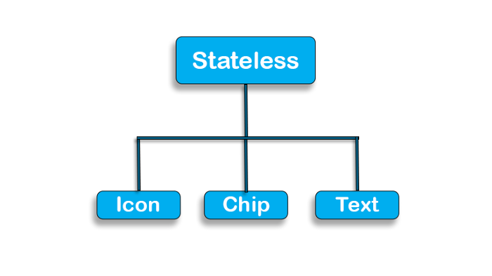
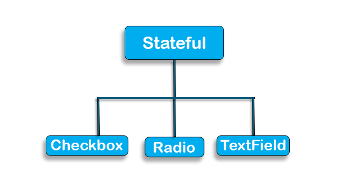
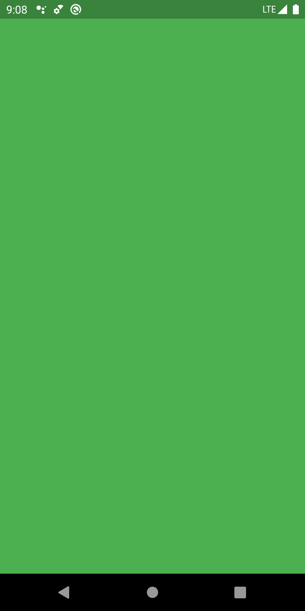
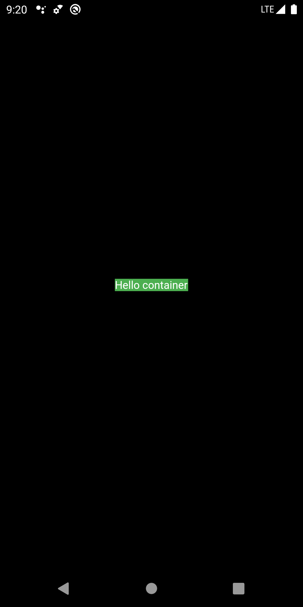
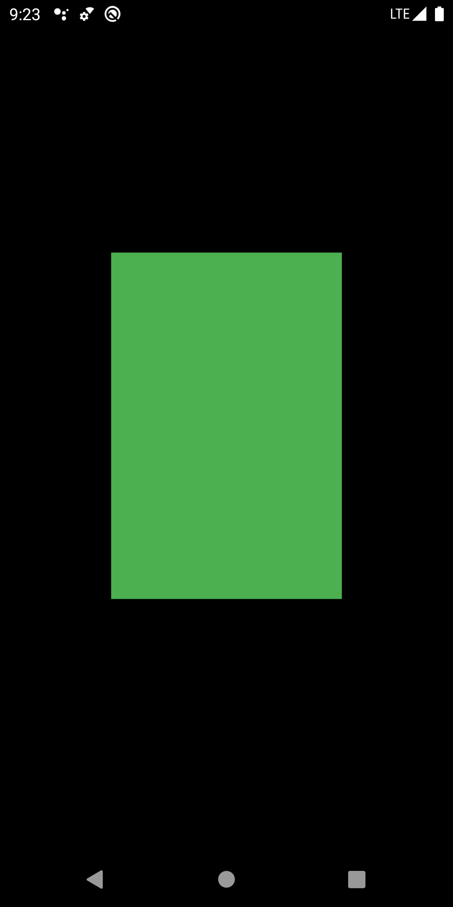

:memo: <span style="color:orange">FLUTTER_003_FVM_STATE_MATERIAL_APP</span>

# FVM, STATE & MATERIAL APP


## Table of Content

- [FVM, STATE \& MATERIAL APP](#fvm-state--material-app)
  - [Table of Content](#table-of-content)
  - [I. FVM](#i-fvm)
    - [1. Tại sao cần FVM?](#1-tại-sao-cần-fvm)
    - [2. FVM overview](#2-fvm-overview)
  - [II. Statefull, Stateless, vòng đời của một state](#ii-statefull-stateless-vòng-đời-của-một-state)
    - [1. Stateless](#1-stateless)
    - [2. Statefull](#2-statefull)
    - [3. Vòng đời của một State](#3-vòng-đời-của-một-state)
      - [1. Giai đoạn create](#1-giai-đoạn-create)
      - [2. Giai đoạn update](#2-giai-đoạn-update)
      - [3. Giai đoạn destroy](#3-giai-đoạn-destroy)
      - [4. Tóm tắt phương thức](#4-tóm-tắt-phương-thức)
  - [III. MaterialApp](#iii-materialapp)
  - [IV. Scaffold](#iv-scaffold)
  - [V. Container](#v-container)
  - [VI. Text](#vi-text)
  - [VII. TextField](#vii-textfield)
  - [VIII. Button](#viii-button)
    - [1. ElevatedButton](#1-elevatedbutton)
    - [2. TextButton](#2-textbutton)
    - [3. OutlinedButton](#3-outlinedbutton)
    - [4. IconButton](#4-iconbutton)
    - [5. FloatingActionButton](#5-floatingactionbutton)
  - [IX. Column, Row, Stack](#ix-column-row-stack)
    - [1. Main Axis](#1-main-axis)
    - [2. Cross Axis](#2-cross-axis)
    - [3. Stack Alignment](#3-stack-alignment)

## I. FVM

### 1. Tại sao cần FVM?

- Khi cần quản lý và duy trì các dự án với các phiên bản Flutter khác nhau, sự linh hoạt của Flutter Version Management (FVM) trở nên quan trọng. FVM không chỉ giúp chuyển đổi linh hoạt giữa các phiên bản mà còn tối ưu hóa thời gian quản lý, giúp nhà phát triển duy trì và phát triển dự án một cách hiệu quả.

- Vấn đề gặp phải:
  - Cần phát triển một dự án với yêu cầu sử dụng Flutter version mới nhất (3.16.5) cho phần nền tảng hiện tại. Đồng thời, cũng cần tiếp tục phát triển các phần tiếp theo của dự án khác, nơi yêu cầu sử dụng một phiên bản Flutter cũ hơn (3.3.3). Điều này đặt ra câu hỏi nan giải: Làm thế nào để quản lý hiệu quả việc chuyển đổi giữa các phiên bản của hai dự án khác nhau?
  - Có thể xử lý bằng cách tải lại SDK và áp dụng, nhưng sẽ tốn thời gian, không hiệu quả.
  - FVM cho phép dễ dàng chuyển đổi giữa các phiên bản Flutter mà không gặp phải quá trình chờ đợi và cài đặt lặp lại. Điều này giúp tối ưu hóa quá trình phát triển, đặc biệt là khi phải làm việc với nhiều dự án đòi hỏi các phiên bản khác nhau.

### 2. FVM overview

[Tham khảo](https://youtu.be/v9iRjM-K1SM?list=PLVnlSO6aQelAAddOFQVJNoaRGZ1mMsj2Q)

> Flutter Version Management là 1 hệ thống quản lý các phiên bản Flutter khác nhau.

- FVM giúp đảm bảo ứng dụng của được xây dựng một cách đồng nhất bằng cách tham chiếu đến phiên bản Flutter SDK được sử dụng cho từng dự án cụ thể. Nó cũng cho phép cài đặt nhiều phiên bản Flutter khác nhau để kiểm tra và thử nghiệm các phiên bản Flutter sắp tới với ứng dụng mà không phải chờ đợi quá trình cài đặt Flutter mỗi lần.

- Cài đặt (Windows):

```bash
choco install fvm

dart pub global activate fvm
```

- Tải SDK:

```bash
fvm install flutter_version
```

- Set as global:

```bash
fvm global flutter_version
```

- Sử dụng:
  - Dể sử dụng FVM theo từng dự án, ta sẽ mở dự án cần thiết lập FVM lên bằng IDE đang sử dụng (Android Studio / VSCode). Sau đó, thực hiện câu lệnh:
  
  ```bash
  fvm use [version]
  ```

- FVM sẽ tự động cấu hình folder: ".fvm" chứa cấu hình của Flutter Version tương ứng trong folder code của dự án.

- Sau khi đã hoàn thành cài đặt, cần mở file: ".gitignore" và thêm đoạn sau:

```bash
.fvm/
```

- Với Android Studio
  - Mở Android Studio và điều hướng đến Languages & Frameworks > Flutter hoặc tìm kiếm Flutter để mở cài đặt.
  - Thay đổi đường dẫn Flutter SDK bằng cách sao chép đường dẫn tuyệt đối của liên kết tượng trưng fvm trong thư mục gốc của dự án. Ví dụ: /absolute-project-path/.fvm/flutter_sdk
  - Áp dụng các thay đổi.
  - Khởi động lại Android Studio để thấy các cài đặt mới được áp dụng.
- Với VSCode
  - Tìm tới file .vscode/settings.json và sử dụng config sau:
  
  ```json
    "dart.flutterSdkPath": ".fvm/flutter_sdk",
  // Remove .fvm files from search
  "search.exclude": {
    "**/.fvm": true
  },
  // Remove from file watching
  "files.watcherExclude": {
    "**/.fvm": true
  }
  ```

[Chi tiết](https://fvm.app/)

:bulb: StatelessWidget, StatefulWidget, MaterialApp, Scaffold, Text, Button, Center, Column, Row, Container, SizedBox, ListView, GridView… đều là những Widget có sẵn trong Flutter SDK.

## II. Statefull, Stateless, vòng đời của một state

- Trong Flutter, StatefulWidget và StatelessWidget là hai loại widget cơ bản, được sử dụng để xây dựng giao diện người dùng. Chúng khác nhau ở khả năng quản lý trạng thái và vòng đời.

- Trong Flutter, State là thông tin về một thứ gì đó được lưu trong bộ nhớ.

### 1. Stateless

- StatelessWidget hiểu nôm na là Widget tĩnh và nó không thể tự thay đổi được những gì mà nó hiển thị sau khi đã được Render xong.
- Widget này cần 1 hàm Widget build(BuildContext context) để render dữ liệu lên màn hình.
- Hàm build chỉ được gọi 1 lần khi ứng dụng đang hoạt động, như vậy thì dữ liệu chỉ được render 1 và không thay đổi suốt quá trình sử dụng ứng dụng. Dữ liệu hiển thị có thể hard code hoặc truyền thông qua hàm Constructors của class và dữ liệu này sẽ không thay đổi suốt quá trình hiển thị trên màn hình.
- Tuy StatelessWidget không thể tự thay đổi được chính nó, nhưng khi Widget cha thay đổi thì StatelessWidget sẽ được khởi tạo lại.

```dart
import 'package:flutter/material.dart';

void main() {
  runApp(MyApp());
}

class MyApp extends StatelessWidget {
  @override
  Widget build(BuildContext context) {
    return Center( // Đặt nội dung vào giữa màn hình
      child: Text( // Văn bản sẽ là "con" của Center
        'Xin chào, Flutter!', // Nội dung hiển thị
        style: TextStyle(fontSize: 24), // Tùy chỉnh cỡ chữ
      ),
    );
  }
}
```



- Vậy chúng ta nên sử dụng StatelessWidget trong trường hợp nào:
  - Hiển thị dữ liệu cứng. ex: Appbar, Title của màn hình vvv
  - Sử dụng trong StatefulWidget để khi StatefulWidget thay đổi trạng thái thì các item con sẽ được render lại.

``` dart
import 'package:flutter/material.dart';

void main() {
  runApp(MyApp(title: 'Xin chào, Flutter!'));
}

class MyApp extends StatelessWidget {
  final String title;

  // Constructor của MyApp
  MyApp({Key? key, required this.title}) : super(key: key);

  @override
  Widget build(BuildContext context) {
    return Center(
      child: Text(
        title, // Sử dụng dữ liệu từ constructor
        style: TextStyle(fontSize: 24),
      ),
    );
  }
}
```

### 2. Statefull

- Khác với StatelessWidget thì StatefulWidget là 1 Widget động và nó có thể thay đổi những gì đang hiển thị bằng cách thay đổi State của chính nó.
- Có hai phần chính:
  - StatefulWidget (lớp chính, không thay đổi).
  - State (lớp chứa trạng thái và logic, có thể thay đổi).
- Widget này cần hàm `State<StatefulWidget> createState()` để cung cấp State cho StatefulWidget.
- Class _MyAppState sẽ overrides phương thức `Widget build(BuildContext context)` hàm này trả về Widget. Đây là nơi định nghĩa UI mà class hiển thị. StatefulWidget quản lý trạng thái UI thông qua State, khi State thay đổi thì StatefulWidget sẽ render lại UI mà nó đang hiển thị.

```dart
import 'package:flutter/material.dart';

void main() {
  runApp(MyApp(title: 'Nút bấm của tôi'));
}

class MyApp extends StatefulWidget {
  final String title;

  // Constructor của MyApp
  MyApp({Key? key, required this.title}) : super(key: key);

  @override
  _MyAppState createState() => _MyAppState();
}

class _MyAppState extends State<MyApp> {
  int _count = 0;

  void _incrementCount() {
    setState(() {
      _count++;
    });
  }

  @override
  Widget build(BuildContext context) {
    return Scaffold(
      appBar: AppBar(
        title: Text(widget.title),
      ),
      body: Center(
        child: Column(
          mainAxisAlignment: MainAxisAlignment.center,
          children: [
            const Text(
              'You have pressed the button this many times:',
              style: TextStyle(fontSize: 18),
            ),
            Text(
              '$_counter',
              style: const TextStyle(fontSize: 36, fontWeight: FontWeight.bold),
            ),
          ],
        ),
      ),
      floatingActionButton: FloatingActionButton(
        onPressed: _incrementCounter,
        child: const Icon(Icons.add),
      ),
    );
  }
}
```

- StatefulWidget cung cấp phương thức setState() để có thể thay đổi State của class.
- Hiểu đơn giản là khi muốn Update UI của StatefulWidget thì cần gọi phương thức setState() để thông báo cho StatefullWidget là tôi muốn bạn UpdateUI.
- Có thể gọi setState() nhiều lần mỗi khi cần thay đổi UI trong vòng đời của ứng dụng.



- Nên sử dụng StatefulWidget trong Widget con của ListView để các item của chúng có thể tự động cập nhật trạng thái mà không cần cả ListView thay đổi trạng thái.

:bulb: Do StatelessWidget không có State nên việc render UI của nó nhẹ hơn và nhanh hơn rất nhiều so với StatefulWidget.

### 3. Vòng đời của một State

:bulb: App là một widget đặc biệt. Ngoài việc xử lý các giai đoạn của view hiển thị (tức là vòng đời của view), cũng cần phải xử lý các state (vòng đời của app) mà app trải qua từ đầu đến khi thoát.

- Vòng đời của state đề cập đến các giai đoạn của widget được liên kết, từ khởi tạo đến hiển thị, cập nhật, dừng, hủy, v.v. Vòng đời của state có thể được chia thành ba giai đoạn: create (chèn view vào cây), update (tồn tại trong cây view), destroy (xóa khỏi cây view).

#### 1. Giai đoạn create

- Khởi tạo state sẽ được thực hiện liên tiếp: phương thức khởi tạo(contructor) -> initstate -> dischangedependencies -> build, và sau đó kết xuất trang sẽ hoàn tất.

- Ý nghĩa của mỗi phương thức trong quá trình khởi tạo như sau:
  - Contructor là điểm bắt đầu của vòng đời state, và flutter sẽ tạo ra một state bằng cách gọi Createstate() của statefullwidget. Bạn có thể nhận dữ liệu cấu hình giao diện người dùng khởi tạo được chuyển bởi widget thông qua contructor. Các dữ liệu cấu hình này xác định hiệu ứng hiển thị ban đầu của widget.
  - Initstate, được gọi khi state object được chèn vào cây view. Hàm này sẽ chỉ được gọi một lần trong vòng đời state, vì vậy bạn có thể thực hiện một số công việc khởi tạo ở đây, chẳng hạn như đặt giá trị mặc định cho các biến trạng thái.
  - Didchangedependencies được sử dụng đặc biệt để xử lý các thay đổi phụ thuộc của state object. Nó sẽ được gọi bởi flutter sau khi initstate() kết thúc.
  - Build được sử dụng để xây dựng các view. Sau các bước trên, framework cho rằng state đó đã sẵn sàng, vì vậy nó gọi là Build. Trong hàm này, bạn có thể tạo một widget và trả lại nó theo dữ liệu cấu hình khởi tạo được truyền bởi widget cha và trạng thái hiện tại của state.

#### 2. Giai đoạn update

- Cập nhật state của widget được kích hoạt bởi ba phương pháp: setstate, didchangedependencies và didupdatewidget.

- Ý nghĩa của 3 phương thức trên:
  - Setstate: khi dữ liệu state thay đổi, hãy gọi phương thức này để nói với flutter: “dữ liệu ở đây đã thay đổi, vui lòng sử dụng dữ liệu cập nhật để xây dựng lại UI!”.
  - Didchangedependencies: sau khi sự phụ thuộc của state object thay đổi, flutter sẽ gọi lại phương thức này và sau đó kích hoạt Build. Một tình huống điển hình là khi ngôn ngữ hệ thống hoặc chủ đề ứng dụng thay đổi, hệ thống sẽ thông báo state để thực thi gọi lại phương thức didchangedependencies.
  - Didupdatewidget: khi cấu hình của một widget thay đổi, chẳng hạn như widget cha kích hoạt rebuild (nghĩa là khi state của widget cha thay đổi), hệ thống sẽ gọi hàm này.
- Sau khi ba phương thức được gọi, flutter sẽ destroy widget cũ và gọi phương thức Build để xây dựng lại widget.

#### 3. Giai đoạn destroy

- Việc phá hủy widget tương đối đơn giản. Ví dụ, khi một widget bị xóa hoặc một trang bị hủy, hệ thống sẽ gọi hai phương thức, deactivate và dispose, để xóa hoặc hủy widget đó.

- Cách thức gọi cụ thể như sau:
  - Khi state hiển thị của widget thay đổi, function deactivate được gọi và state tạm thời bị xóa khỏi cây view. Cần lưu ý rằng trong quá trình chuyển đổi trang, do vị trí của state object trong cây view đã thay đổi, nó cần được tạm thời loại bỏ và sau đó thêm lại để kích hoạt cấu tạo widget một lần nữa, vì vậy hàm này cũng sẽ được gọi.
  - Khi state bị loại bỏ vĩnh viễn khỏi view, flutter gọi hàm dispose. Khi chúng ta đạt đến giai đoạn này, các widget sẽ bị phá hủy, vì vậy chúng ta có thể giải phóng tài nguyên, giải phóng bộ nhớ, v.v.

#### 4. Tóm tắt phương thức

| Tên phương thức       | Chức năng                                                                  | Thời gian gọi                                                   | Số lần gọi |
| --------------------- | -------------------------------------------------------------------------- | --------------------------------------------------------------- | ---------- |
| Construction method   | Nhận dữ liệu cấu hình giao diện người dùng khởi tạo được chuyển bởi widget | Khi tạo state                                                   | 1          |
| initState             | Kết xuất khởi tạo liên quan                                                | Khi state được chèn vào cây view                                | 1          |
| didChangeDependencies | Xử lý các thay đổi phụ thuộc hình thành state                              | Sau initstate và khi sự phụ thuộc của đối state object thay đổi | >= 1       |
| build                 | Chế độ xem build                                                           | Khi state sẵn sàng để hiển thị dữ liệu                          | >= 1       |
| setState              | Tái tạo lại view                                                           | Khi nào giao diện người dùng cần được làm mới                   | >= 1       |
| didUpdateWidget       | Xử lý các thay đổi cấu hình widget                                         | Widget cha setstate kích hoạt build lại widget con              | >= 1       |
| deactivate            | Widget đã bị xóa                                                           | Widget không hiển thị                                           | >= 1       |
| dispose               | Widget bị hủy                                                              | Widget bị xóa vĩnh viễn                                         | 1          |

```dart
import 'package:flutter/material.dart';

class MyStateLifecycleWidget extends StatefulWidget {
  @override
  _MyStateLifecycleWidgetState createState() => _MyStateLifecycleWidgetState();
}

class _MyStateLifecycleWidgetState extends State<MyStateLifecycleWidget> {
  
  // 1. Phương thức được gọi khi state được khởi tạo
  @override
  void initState() {
    super.initState();
    print('initState called');
  }

  // 2. Phương thức được gọi khi widget phụ thuộc vào các đối tượng thay đổi
  @override
  void didChangeDependencies() {
    super.didChangeDependencies();
    print('didChangeDependencies called');
  }

  // 3. Phương thức được gọi khi widget được build lại
  @override
  Widget build(BuildContext context) {
    print('build called');
    return Scaffold(
      appBar: AppBar(title: Text('Lifecycle Example')),
      body: Center(child: Text('Lifecycle Demo')),
    );
  }

  // 4. Phương thức được gọi khi widget cha yêu cầu build lại widget con
  @override
  void didUpdateWidget(covariant MyStateLifecycleWidget oldWidget) {
    super.didUpdateWidget(oldWidget);
    print('didUpdateWidget called');
  }

  // 5. Phương thức được gọi khi widget bị vô hiệu hóa (deactivated)
  @override
  void deactivate() {
    super.deactivate();
    print('deactivate called');
  }

  // 6. Phương thức được gọi khi widget bị hủy (dispose)
  @override
  void dispose() {
    print('dispose called');
    super.dispose();
  }
}

void main() {
  runApp(MaterialApp(
    home: MyStateLifecycleWidget(),
  ));
}
```

## III. MaterialApp

> MaterialApp là một widget cốt lõi trong Flutter, cung cấp cấu trúc cơ bản và các tính năng cần thiết để xây dựng ứng dụng tuân theo Material Design, một ngôn ngữ thiết kế phổ biến được Google phát triển.

- Khi tạo một ứng dụng Flutter, thường sẽ khởi đầu bằng cách bọc ứng dụng trong một widget MaterialApp. Nó giúp dễ dàng xây dựng giao diện người dùng hiện đại, nhất quán và trực quan theo tiêu chuẩn Material Design.

- Chức năng của MaterialApp:
  - Cung cấp cấu trúc cơ bản:
    - Nó tạo cấu trúc chính cho ứng dụng, như màn hình chính (home), các tuyến đường (routes), và cách chuyển đổi giữa các màn hình (navigation).
  - Áp dụng Material Design:
    - Tự động hỗ trợ các yếu tố Material Design như AppBar, FloatingActionButton, Drawer, SnackBar,...
  - Quản lý chủ đề (Theme):
    - Cho phép bạn tùy chỉnh màu sắc, phông chữ và phong cách của ứng dụng bằng cách sử dụng ThemeData.
  - Quản lý điều hướng và định tuyến:
    - Hỗ trợ điều hướng giữa các màn hình với routes hoặc onGenerateRoute.
  - Hỗ trợ các tiện ích khác:
    - Cung cấp hỗ trợ cài đặt ngôn ngữ (localization) và điều chỉnh hướng giao diện (debugShowCheckedModeBanner, title).

``` dart
class MaterialAppWidget extends StatelessWidget {
  const MaterialAppWidget({super.key});

  @override
  Widget build(BuildContext context) {
    return MaterialApp(
      title: 'My Themed App',
      theme: ThemeData(
        primarySwatch: Colors.blue,
      ),
      darkTheme: ThemeData.dark(),
      themeMode: ThemeMode.system,
      initialRoute: '/',
      routes: {
        '/': (context) => Scaffold(
              appBar: AppBar(
                title: const Text('My First Page'),
              ),
              body: const Center(
                child: Text('Hello, World!'),
              ),
            ),
        '/second': (context) => Scaffold(
              appBar: AppBar(
                title: const Text('My Second Page'),
              ),
              body: const Center(
                child: Text('Hello, World!'),
              ),
            ),
      },
    );
  }
}
```

- Các thuộc tính chính của MaterialApp:

| Thuộc tính                     | Mô tả                                                                                   |
| ------------------------------ | --------------------------------------------------------------------------------------- |
| *`title`*                      | Mô tả một dòng về ứng dụng, được sử dụng trong trình quản lý tác vụ và trình chuyển đổi cửa sổ.                                        |
| *`routes`*                     | Định nghĩa các đường dẫn cho điều hướng (routing).                                      |
| *`color`*                      | Màu chính của ứng dụng, được sử dụng cho thương hiệu và các yếu tố trực quan khác.                                         |
| *`theme`*                      | Xác định giao diện chủ đề cho toàn bộ ứng dụng.                                         |
| *`darkTheme`*                  | Chủ đề ứng dụng khi ở chế độ tối (Dark Mode).                                           |
| *`themeMode`*                  | Chuyển đổi giữa chế độ sáng, tối, hoặc theo hệ thống (ThemeMode.light, ThemeMode.dark). |
| *`home`*                       | Thường là tiện ích Scaffold chứa nội dung chính của ứng dụng.                                                       |
| *`initialRoute`*               | Tên của route đầu tiên sẽ hiển thị khi ứng dụng khởi động.                                     |
| *`debugShowCheckedModeBanner`* | Cờ boolean kiểm soát việc hiển thị biểu ngữ "gỡ lỗi" ở góc trên bên phải của ứng dụng.                       |
| *`navigatorKey`*               | Sử dụng để truy cập NavigatorState ứng dụng.                                                |

## IV. Scaffold

- Widget Scaffold là một khung để thêm các yếu tố thiết kế widget phổ biến như AppBars, Drawers, Floating Action Buttons, Bottom Navigation, etc.
  - AppBar: Thanh tiêu đề ở đầu màn hình.
  - Drawer: Menu điều hướng ở bên trái hoặc phải màn hình.
  - FloatingActionButton: Nút nổi để thực hiện các hành động chính.
  - BottomNavigationBar: Thanh điều hướng ở dưới cùng màn hình.
  - SnackBar: Hiển thị thông báo tạm thời.
  - Body: Phần nội dung chính của màn hình.

```dart
new Scaffold(
  appBar: new AppBar(
    title: new Text(widget.title),
  ),
  body: Center(
  ),
  floatingActionButton: FloatingActionButton(
      child:Icon(Icons.add),
      onPressed: () {
      }
  ),
)
```

| Thuộc tính                       | Kiểu dữ liệu                  | Mô tả                                                                       |
| -------------------------------- | ----------------------------- | --------------------------------------------------------------------------- |
| `appBar`                         | `PreferredSizeWidget?`        | Thanh công cụ hoặc tiêu đề của màn hình.                                    |
| `body`                           | `Widget?`                     | Nội dung chính của màn hình.                                                |
| `floatingActionButton`           | `Widget?`                     | Nút nổi để thực hiện các hành động chính.                                   |
| `floatingActionButtonLocation`   | FloatingActionButtonLocation? | Vị trí của `FloatingActionButton`.                                          |
| `floatingActionButtonAnimator`   | FloatingActionButtonAnimator? | Hiệu ứng chuyển động của `FloatingActionButton`.                            |
| `drawer`                         | `Widget?	`                    | Menu điều hướng trượt từ bên trái màn hình.                                 |
| `endDrawer`                      | `Widget?`                     | Menu điều hướng trượt từ bên phải màn hình.                                 |
| `bottomNavigationBar`            | `Widget?`                     | Thanh điều hướng ở dưới cùng màn hình.                                      |
| `bottomSheet`                    | `Widget?`                     | Widget hiển thị như một bảng trượt từ dưới lên (Bottom Sheet).              |
| `backgroundColor`                | C`olor?`                      | Màu nền của Scaffold.                                                       |
| `resizeToAvoidBottomInset`       | `bool?`                       | Tự động thay đổi kích thước body khi bàn phím xuất hiện (mặc định: `true`). |
| `drawerEnableOpenDragGesture`    | `bool`                        | Có cho phép kéo để mở drawer hay không (mặc định: `true`).                  |
| `endDrawerEnableOpenDragGesture` | `bool`                        | Có cho phép kéo để mở `endDrawer`hay không (mặc định: `true`).              |
| `onDrawerChanged`                | `ValueChanged<bool>?`         | Gọi lại khi trạng thái `drawer` thay đổi (đóng/mở).                         |
| `onEndDrawerChanged`             | `ValueChanged<bool>?`         | Gọi lại khi trạng thái `endDrawer` thay đổi (đóng/mở).                      |
| `persistentFooterButtons`        | `List<Widget>?	`              | Danh sách các nút hiển thị cố định ở cuối màn hình.                         |

## V. Container

- Container là một trong số những widget hay được sử dụng nhất khi code UI trong flutter.
- Container widget chứa một child widget và một số thuộc tính tiện ích khác.

```dart
main() {
  runApp(App());
}

class App extends StatelessWidget {
  @override
  Widget build(BuildContext context) {
    return Center(
      child: Container(
        color: Colors.green,
      ),
    );
  }
}
```

- Nếu không có child thì container sẽ có kích thước lớn nhất có thể. Nếu có child thì container sẽ theo kích thước child của nó.

```dart
      child: Container(
        color: Colors.green,
      ),
```



```dart
    return Center(
      child: Container(
        color: Colors.green,
        child: Text(
          'Hello container',
          textDirection: TextDirection.ltr,
        ),
      ),
    );
```



```dart
    return Center(
      child: Container(
        color: Colors.green,
        child: SizedBox(
          width: 200,
          height: 300,
        ),
      ),
    );
```



| Thuộc tính    | Kiểu dữ liệu     | Mô tả                                                                                                                                   |
| ------------- | ---------------- | --------------------------------------------------------------------------------------------------------------------------------------- |
| `color`       | `Color`          | Thiết lập màu nền của `Container`. Nếu không đặt, mặc định là trong suốt.                                                               |
| `width`       | `double`         | Xác định chiều rộng của `Container`. Nếu không đặt, `Container` sẽ có chiều rộng tự động dựa vào widget con.                            |
| `height`      | `double`         | Xác định chiều cao của `Container`. Nếu không đặt, `Container` sẽ có chiều cao tự động dựa vào widget con.                              |
| `padding`     | `EdgeInsets`     | Tạo khoảng cách bên trong `Container`, giữa `Container` và widget con.                                                                  |
| `margin`      | `EdgeInsets`     | Tạo khoảng cách bên ngoài `Container`, giữa `Container` và các widget khác trong giao diện.                                             |
| `decoration`  | `BoxDecoration`  | Gán một số thuộc tính về UI cho container, thứ tự ưu tiên hiển thỉ lên trên của decoration: foregroundDecoration > child > decoration.                                               |
| `alignment`   | `Alignment`      | Căn chỉnh child widget của `Container` với giá trị x, y mong muốn hoặc sử dụng các hằng số có sẵn.                                        |
| `constraints` | `BoxConstraints` | Đặt các ràng buộc kích thước cho `Container`, bao gồm chiều rộng và chiều cao tối thiểu và tối đa.                                      |
| `transform`   | `Matrix4`        | Sử dụng thuộc tính này để thực hiện chuyển đổi container.                                                                 |

## VI. Text

- Text dùng để hiển thị 1 chuỗi, hay 1 đoạn văn bản với 1 style duy nhất.
- Việc hiển thị này có thể trên 1 dòng, nhiều dòng tùy vào cách định dạng style cho nó.
- Để định dạng style cho Text sử dụng thuộc tính style của Text, đây là 1 thuộc tính optional. Nếu không sử dụng style, mặc định Text sẽ được set style là DefaultTextStyle.

```dart
Text("Hello World!")
```

| Thuộc tính        | Kiểu dữ liệu     | Mô tả                                                                                                              |
| ----------------- | ---------------- | ------------------------------------------------------------------------------------------------------------------ |
| `data`            | `String`         | Chuỗi văn bản cần hiển thị. Đây là thuộc tính bắt buộc khi sử dụng widget `Text`.                                  |
| `style`           | `TextStyle`      | Dùng để định nghĩa các style cho text như: màu chữ, màu nền, kích thước font, kiểu font, khoảng cách giữa các từ của text, khoảng cách giữa các ký tự của từ, .....                                   |
| `textAlign`       | `TextAlign`      | Dùng để căn chỉnh text theo chiều ngang (trái, phải, giữa, v.v.).                                                        |
| `overflow`        | `TextOverflow`   | Dùng để xử lý hiển thị text khi bị tràn dòng.         |
| `maxLines`       | `int`            | Dùng để xác định số dòng hiển thị tối đa của text Nếu số dòng text vượt quá maxLines thì nó sẽ bị cắt ngắn dựa theo thuộc tính overflow.                                                                   |
| `softWrap`        | `bool`           | Xác định xem văn bản có thể xuống dòng hay không. Nếu là `true`, văn bản sẽ tự động xuống dòng khi hết không gian. |
| `textScaleFactor` | `double`         | Dùng để tăng giảm tỉ lệ kích thước font của text.                                  |
| `strutStyle`      | `StrutStyle`     | Xác định chiều cao của dòng trong văn bản, giúp điều chỉnh khoảng cách giữa các dòng chữ.                          |
| `textWidthBasis`  | `TextWidthBasis` | Xác định cách tính chiều rộng của văn bản (tính theo văn bản hoặc theo toàn bộ widget chứa nó).                    |
| `locale`          | `Locale`         | Cung cấp ngôn ngữ và quốc gia mà văn bản cần hiển thị.                                                             |

## VII. TextField

-Một widget TextField cho phép thu thập thông tin từ người dùng.

```dart
TextField()
```

- Vì TextField không có ID như trong Android, văn bản không thể được truy xuất theo yêu cầu và thay vào đó phải được lưu trữ trong một biến khi thay đổi hoặc sử dụng bộ điều khiển.
  - Cách dễ nhất để làm điều này là sử dụng phương thức onChanged và lưu trữ giá trị hiện tại trong một biến đơn giản:
  
  ```dart
  String value = "";
  TextField(
    onChanged: (text) {
      value = text;
    },
  )
  ```

  - Cách thứ hai để làm điều này là sử dụng TextEditingController.

  ```dart
  TextEditingController controller = TextEditingController();
  TextField(
    controller: controller,
  )

  controller.addListener(() {
    // Do something here
  });

  print(controller.text); // Print current value
  controller.text = "Demo Text"; // Set new value
  ```

- Callback khác từ TextField:

```dart
onEditingComplete: () {},
onSubmitted: (value) {},
```

- Đây là các callback được gọi trên các hành động như khi người dùng nhấp vào nút "Done" button trên bàn phím iOS.

- Có một TextField được focus có nghĩa là có một TextField hoạt động và mọi đầu vào từ bàn phím sẽ dẫn đến dữ liệu được nhập vào TextField đã focus đó.

```dart
TextField(
  autofocus: true,
),
```

- Để thay đổi focus theo nhu cầu, đính kèm FocusNode vào TextField và sử dụng nó để chuyển focus.

```dart
// Initialise outside the build method
FocusNode nodeOne = FocusNode();
FocusNode nodeTwo = FocusNode();
// Do this inside the build method
TextField(
  focusNode: nodeOne,
),
TextField(
  focusNode: nodeTwo,
),
RaisedButton(
  onPressed: () {
    FocusScope.of(context).requestFocus(nodeTwo);
  },
  child: Text("Next Field"),
),
```

- Ví dụ: Tạo hai nút focus và đính kèm chúng vào TextFields. Khi nhấn nút, sử dụng FocusScope để yêu cầu focus cho TextField tiếp theo.
- TextField trong Flutter cũng cho phép bạn tùy chỉnh các thuộc tính liên quan đến bàn phím:
  - Loại keyboard:
    - TextInputType.text (Normal complete keyboard)
    - TextInputType.number (A numerical keyboard)
    - TextInputType.emailAddress (Normal keyboard with an “@”)
    - TextInputType.datetime (Numerical keyboard with a “/” and “:”)
    - TextInputType.numberWithOptions (Numerical keyboard with options to enabled signed and decimal mode)
    - TextInputType.multiline (Optimises for multi-line information)
  - textInputAction của TextField cho phép thay đổi nút hành động của chính bàn phím.

  

  
  - Autocorrect.
  - TextCapitalization.
- Flutter cho phép tùy chỉnh liên quan đến kiểu dáng và căn chỉnh văn bản bên trong TextField cũng như con trỏ bên trong TextField.

```dart
TextField(
  textAlign: TextAlign.center,
),
TextField(
  style: TextStyle(color: Colors.red, fontWeight: FontWeight.w300),
),
TextField(
  cursorColor: Colors.red,
  cursorRadius: Radius.circular(16.0),
  cursorWidth: 16.0,
),
```

- Kiểm soát kích thước và độ dài tối đa trong TextField.

```dart
TextField(
  maxLength: 4,
),
```

- Che khuất văn bản.
- Trang trí.

## VIII. Button

- `Button` là một widget phổ biến dùng để tạo các nút tương tác với người dùng.
- Flutter cung cấp nhiều loại nút khác nhau, mỗi loại nút có các đặc điểm và cách sử dụng riêng.

### 1. ElevatedButton

- Một nút nổi với hiệu ứng bóng đổ, thường dùng để làm nổi bật hành động chính.

```dart
ElevatedButton(
  onPressed: () {
    print('ElevatedButton clicked');
  },
  child: Text('Click Me'),
)
```

### 2. TextButton

- Một nút văn bản phẳng không có hiệu ứng bóng đổ. Phù hợp cho các hành động phụ hoặc không quan trọng.

```dart
TextButton(
  onPressed: () {
    print('TextButton clicked');
  },
  child: Text('Tap Here'),
)
```

### 3. OutlinedButton

- Một nút với đường viền bao quanh, thường được dùng cho các hành động thứ cấp.

```dart
OutlinedButton(
  onPressed: () {
    print('OutlinedButton clicked');
  },
  child: Text('Outline Button'),
)
```

### 4. IconButton

- Một nút chỉ chứa icon, thường được dùng cho các hành động như chỉnh sửa, xóa, hoặc thêm.

```dart
IconButton(
  onPressed: () {
    print('IconButton clicked');
  },
  icon: Icon(Icons.favorite),
)
```

### 5. FloatingActionButton

- Một nút tròn nổi, thường được dùng cho các hành động chính trên một màn hình.

```dart
FloatingActionButton(
  onPressed: () {
    print('FloatingActionButton clicked');
  },
  child: Icon(Icons.add),
)
```

- Các thuộc tính:
  - onPressed: Định nghĩa hành động sẽ thực hiện khi nút được nhấn.
  - onLongPress: Định nghĩa hành động khi nút được nhấn giữ.
  - child: Định nghĩa nội dung hiển thị bên trong nút (text, icon,...).
  - style: Tùy chỉnh giao diện nút (màu sắc, kích thước, viền, font chữ, v.v.).
  
```dart
ElevatedButton(
  onPressed: () {
    print('Custom ElevatedButton');
  },
  style: ElevatedButton.styleFrom(
    primary: Colors.blue, // Màu nền
    onPrimary: Colors.white, // Màu chữ
    padding: EdgeInsets.symmetric(horizontal: 20, vertical: 10),
    shape: RoundedRectangleBorder(
      borderRadius: BorderRadius.circular(30),
    ),
  ),
  child: Text('Custom Button'),
)
```

```
import 'package:flutter/material.dart';

void main() {
  runApp(MyApp());
}

class MyApp extends StatelessWidget {
  @override
  Widget build(BuildContext context) {
    return MaterialApp(
      home: ButtonExample(),
    );
  }
}

class ButtonExample extends StatelessWidget {
  @override
  Widget build(BuildContext context) {
    return Scaffold(
      appBar: AppBar(
        title: Text('Button Examples'),
      ),
      body: Center(
        child: Column(
          mainAxisAlignment: MainAxisAlignment.center,
          children: [
            ElevatedButton(
              onPressed: () {
                print('ElevatedButton pressed');
              },
              child: Text('ElevatedButton'),
            ),
            TextButton(
              onPressed: () {
                print('TextButton pressed');
              },
              child: Text('TextButton'),
            ),
            OutlinedButton(
              onPressed: () {
                print('OutlinedButton pressed');
              },
              child: Text('OutlinedButton'),
            ),
            IconButton(
              onPressed: () {
                print('IconButton pressed');
              },
              icon: Icon(Icons.thumb_up),
            ),
            FloatingActionButton(
              onPressed: () {
                print('FloatingActionButton pressed');
              },
              child: Icon(Icons.add),
            ),
          ],
        ),
      ),
    );
  }
}
```

| **Loại Button**          | **Khi nào dùng**                                                         |
| ------------------------ | ------------------------------------------------------------------------ |
| **ElevatedButton**       | Hành động chính, cần làm nổi bật.                                        |
| **TextButton**           | Hành động phụ, không cần gây chú ý.                                      |
| **OutlinedButton**       | Hành động thứ cấp, cần phân biệt nhưng không quá nổi bật.                |
| **IconButton**           | Hành động mang tính biểu tượng (ví dụ: thêm, chỉnh sửa, xóa).            |
| **FloatingActionButton** | Hành động quan trọng trên màn hình, thường dùng cho một tính năng chính. |

## IX. Column, Row, Stack


- Trong Flutter, Rows, Columns, và Stackslà các tiện ích bố cục cơ bản giúp cấu trúc UI bằng cách sắp xếp các tiện ích khác theo các cách sắp xếp trực quan khác nhau. Sau đây là cách hoạt động của từng tiện ích:

  - Row : Sắp xếp các widget con của nó theo một đường ngang. Điều này hữu ích khi muốn đặt các phần tử cạnh nhau trên màn hình.

  - Column : Sắp xếp các widget con theo chiều dọc, xếp chồng chúng từ trên xuống dưới. Điều này lý tưởng để đặt các thành phần cần xuất hiện theo trình tự dọc, chẳng hạn như danh sách tin nhắn trong ứng dụng trò chuyện hoặc mục nhập trong biểu mẫu.

  - Stack : Sắp xếp các widget con lên trên nhau, cho phép các phần tử chồng lên nhau. Trong Stack, các widget có thể được định vị tuyệt đối so với các cạnh của Stack, giúp kiểm soát vị trí chính xác của từng phần tử.

- Mỗi tiện ích này phục vụ các mục đích khác nhau và việc lựa chọn giữa chúng phụ thuộc vào cách sắp xếp các thành phần UI của mình.

### 1. Main Axis

- Trục chính là hướng chính mà các tiện ích con được bố trí trong Row hoặc Column.

Row: Trục chính chạy theo chiều ngang. Các tiện ích con được sắp xếp từ trái sang phải.


Column: Trục chính chạy theo chiều dọc. Các tiện ích con được bố trí từ trên xuống dưới.


### 2. Cross Axis

- Trục phụ vuông góc với trục chính và điều khiển sự căn chỉnh và khoảng cách của các tiện ích trên hướng phụ này. Nó có các loại sau: Start, Center, End.

Row: Trục chéo chạy theo chiều dọc. Nó xác định cách các tiện ích con được căn chỉnh từ trên xuống dưới trong hàng.


Column: Trục chéo chạy theo chiều ngang . Nó kiểm soát cách các tiện ích con căn chỉnh từ trái sang phải trong cột.


### 3. Stack Alignment

- Đối với Stack, khái niệm trục chính và trục chéo ít áp dụng hơn vì các tiện ích được căn chỉnh theo toàn bộ diện tích.
- Trong FlutterFlow, có thể căn chỉnh của các phần tử con của Stack bằng thuộc tính có tên là Default Child Alignment, thuộc tính này định vị các phần tử con bằng tọa độ X và Y.


[Expansion & Flex (for Row & Column)](https://docs.flutterflow.io/resources/ui/widgets/composing-widgets/rows-column-stack/#expansion--flex-for-row--column)

[Scrollability (for Row & Column)](https://docs.flutterflow.io/resources/ui/widgets/composing-widgets/rows-column-stack/#scrollability)

[Spacing (for Row & Column)](https://docs.flutterflow.io/resources/ui/widgets/composing-widgets/rows-column-stack/#spacing)
