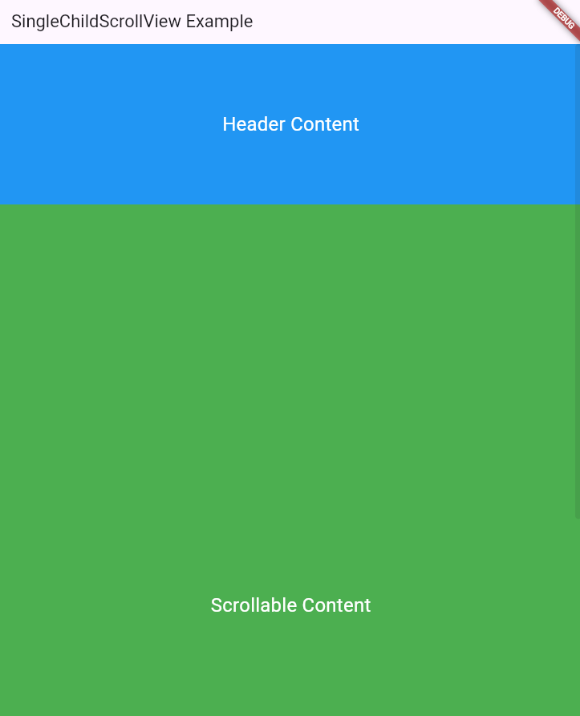
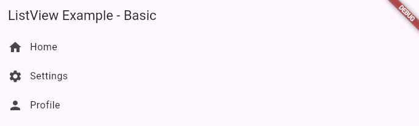
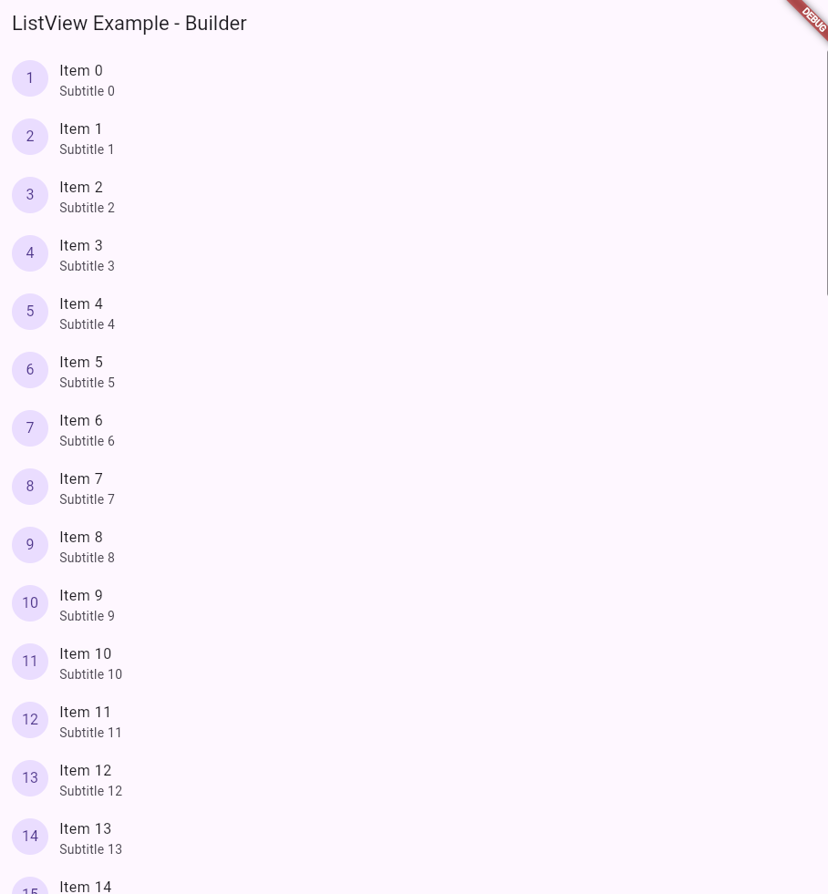
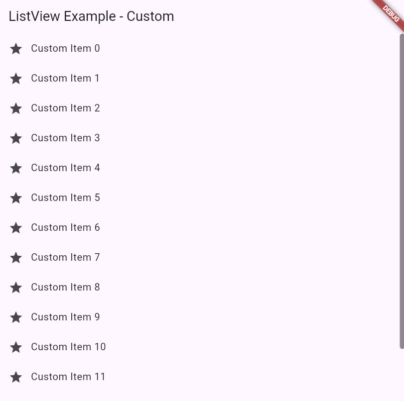
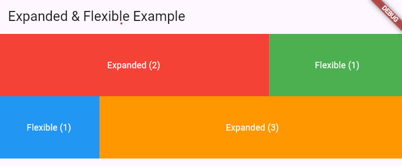

:memo: <span style="color:orange">FLUTTER_004_VIEW_NAVIGATE_PUB_DEV</span>

# CÁC VIEW, NAVIGATE, DIALOG & PUB DEV


## Table of Content

- [CÁC VIEW, NAVIGATE, DIALOG \& PUB DEV](#các-view-navigate-dialog--pub-dev)
  - [Table of Content](#table-of-content)
  - [I. View](#i-view)
    - [1. SingleScrollView](#1-singlescrollview)
    - [2. ListView](#2-listview)
    - [3. GridView](#3-gridview)
  - [II. Expanded and Flexible](#ii-expanded-and-flexible)
    - [1. Expanded](#1-expanded)
    - [2. Flex](#2-flex)
  - [III. Navigate, dialog, bottom sheet](#iii-navigate-dialog-bottom-sheet)
    - [1. Navigate](#1-navigate)
    - [2. Dialog](#2-dialog)
    - [3. Bottom sheet](#3-bottom-sheet)
  - [IV. Tìm hiểu về pub dev](#iv-tìm-hiểu-về-pub-dev)

## I. View

### 1. SingleScrollView

> **SingleChildScrollView** là một widget cuộn (scrollable) cho phép hiển thị nội dung dài mà không vừa trong màn hình.

- Hỗ trợ cuộn theo chiều dọc hoặc chiều ngang thông qua `scrollDirection`.
- Phù hợp với danh sách nhỏ hoặc ít nội dung: SingleChildScrollView tải toàn bộ nội dung vào bộ nhớ => Hiệu năng không tốt với danh sách lớn.

```dart
import 'package:flutter/material.dart';

void main() {
  runApp(MyApp());
}

class MyApp extends StatelessWidget {
  @override
  Widget build(BuildContext context) {
    return MaterialApp(
      home: Scaffold(
        appBar: AppBar(
          title: Text('SingleChildScrollView Example'),
        ),
        body: SingleChildScrollView(
          child: Column(
            children: <Widget>[
              Container(
                height: 200.0,
                color: Colors.blue,
                child: Center(
                  child: Text(
                    'Header Content',
                    style: TextStyle(
                      color: Colors.white,
                      fontSize: 24.0,
                    ),
                  ),
                ),
              ),
              Container(
                height: 1000.0, // This container's height exceeds the screen height.
                color: Colors.green,
                child: Center(
                  child: Text(
                    'Scrollable Content',
                    style: TextStyle(
                      color: Colors.white,
                      fontSize: 24.0,
                    ),
                  ),
                ),
              ),
            ],
          ),
        ),
      ),
    );
  }
}
```



- SingleChildScrollView đảm bảo rằng người dùng có thể cuộn qua nội dung trong vùng chứa thứ hai, ngay cả khi nó vượt quá chiều cao màn hình.

- Lưu ý:
  - Nó thường bao gồm một tiện ích con duy nhất, chẳng hạn như Column hoặc ListView, widget con chứa nội dung có thể cuộn.
  - Tránh lồng nhiều scroll view vì nó có thể dẫn đến xung đột và hành vi không mong muốn.
  - SingleChildScrollView tự động cung cấp hành vi cuộn dựa trên không gian màn hình có sẵn.

| Thuộc tính                | Mô tả                                                                           | Giá trị mặc định                           |
| ------------------------- | ------------------------------------------------------------------------------- | ------------------------------------------ |
| `child`                   | Tiện ích con chính chứa nội dung có thể cuộn                                    | `null`                                     |
| `scrollDirection`         | Hướng cuộn (dọc/ngang)                                                          | `Axis.vertical`                            |
| `reverse`                 | Nếu `true`, nội dung sẽ cuộn theo hướng ngược lại                               | `false`                                    |
| `padding`                 | Thêm khoảng cách (padding) xung quanh nội dung                                  | `null`                                     |
| `clipBehavior`            | Xác định cách nội dung bị cắt khi vượt ra ngoài kích thước của widget           | `Clip.hardEdge`                            |
| `primary`                 | Xác định xem SingleChildScrollView có sử dụng PrimaryScrollController hay không | `false` nếu đã có controller               |
| `controller`              | Một đối tượng `ScrollController` để quản lý cuộn                                | `null`                                     |
| `keyboardDismissBehavior` | Xác định cách ẩn bàn phím khi cuộn                                              | `ScrollViewKeyboardDismissBehavior.manual` |

### 2. ListView

> ListView là widget danh sách cuộn được tối ưu hóa hiệu năng, phù hợp để hiển thị danh sách dài.

```dart
import 'package:flutter/material.dart';

void main() => runApp(MyApp());

class MyApp extends StatelessWidget {
  @override
  Widget build(BuildContext context) {
    return MaterialApp(
      home: Scaffold(
        appBar: AppBar(title: Text("ListView Example - Basic")),
        body: ListView(
          children: [
            ListTile(
              leading: Icon(Icons.home),
              title: Text("Home"),
            ),
            ListTile(
              leading: Icon(Icons.settings),
              title: Text("Settings"),
            ),
            ListTile(
              leading: Icon(Icons.person),
              title: Text("Profile"),
            ),
          ],
        ),
      ),
    );
  }
}
```



- Các loại ListView:
  - ListView(): Danh sách cơ bản. Thông thường đối với loại trên sẽ sử dụng với số lượng children (số item) nhỏ.
  - ListView.builder(): Dành cho danh sách lớn hoặc không xác định trước, sử dụng trình tạo (builder) để hiển thị item.
  - ListView.separated(): Cho phép thêm widget separator (phân cách) giữa các item, chẳng hạn như đường kẻ hoặc khoảng trống.
  - ListView.custom(): Tùy chỉnh hiển thị danh sách.
- Đặc điểm:
  - Hiệu suất cao
  - Chỉ tải các item hiện đang hiển thị
  - Hỗ trợ cuộn vô hạn
  - Thích hợp cho danh sách động

```dart
import 'package:flutter/material.dart';

void main() => runApp(MyApp());

class MyApp extends StatelessWidget {
  @override
  Widget build(BuildContext context) {
    return MaterialApp(
      home: Scaffold(
        appBar: AppBar(title: Text("ListView Example - Builder")),
        body: ListView.builder(
          itemCount: 50, // Số lượng phần tử
          itemBuilder: (context, index) {
            return ListTile(
              leading: CircleAvatar(
                child: Text('${index + 1}'),
              ),
              title: Text('Item $index'),
              subtitle: Text('Subtitle $index'),
            );
          },
        ),
      ),
    );
  }
}
```



```dart
import 'package:flutter/material.dart';

void main() => runApp(MyApp());

class MyApp extends StatelessWidget {
  @override
  Widget build(BuildContext context) {
    return MaterialApp(
      home: Scaffold(
        appBar: AppBar(title: Text("ListView Example - Separated")),
        body: ListView.separated(
          itemCount: 10,
          itemBuilder: (context, index) {
            return ListTile(
              title: Text("Item $index"),
              trailing: Icon(Icons.arrow_forward),
            );
          },
          separatorBuilder: (context, index) {
            return Divider(
              color: Colors.grey,
              thickness: 1,
            );
          },
        ),
      ),
    );
  }
}
```


- ListView.custom(): Dùng để tạo danh sách tùy chỉnh với SliverChildDelegate.

```dart
import 'package:flutter/material.dart';

void main() => runApp(MyApp());

class MyApp extends StatelessWidget {
  @override
  Widget build(BuildContext context) {
    return MaterialApp(
      home: Scaffold(
        appBar: AppBar(title: Text("ListView Example - Custom")),
        body: ListView.custom(
          childrenDelegate: SliverChildBuilderDelegate(
            (context, index) => ListTile(
              leading: Icon(Icons.star),
              title: Text('Custom Item $index'),
            ),
            childCount: 15, // Số lượng phần tử
          ),
        ),
      ),
    );
  }
}
```



| Thuộc tính        | Mô tả                                          | Giá trị mặc định                |
| ----------------- | ---------------------------------------------- | ------------------------------- |
| `scrollDirection` | Hướng cuộn (dọc/ngang)                         | `Axis.vertical`                 |
| `reverse`         | Đảo ngược hướng cuộn                           | `false`                         |
| `padding`         | Khoảng cách xung quanh nội dung                | `null`                          |
| `physics`         | Hành vi cuộn                                   | `AlwaysScrollableScrollPhysics` |
| `shrinkWrap`      | Co danh sách theo nội dung                     | `false`                         |
| `itemExtent`      | Chiều cao/cỡ cố định cho các phần tử           | `null`                          |
| `cacheExtent`     | Khoảng cache ngoài màn hình                    | `250.0`                         |
| `controller`      | Quản lý sự kiện cuộn                           | `null`                          |
| `primary`         | Có liên kết với PrimaryScrollController không? | `true`                          |
| `clipBehavior`    | Hành vi cắt nội dung                           | `Clip.hardEdge`                 |

### 3. GridView

> GridView hiển thị các item theo dạng lưới (grid), có thể cố định số cột hoặc tự động điều chỉnh.

- Các loại GridView:
  - GridView.count(): Kiểu GridView này tạo ra một lưới có thể cuộn với số lượng mục cố định trong mỗi hàng hoặc cột. Có thể chỉ định số lượng và tùy chỉnh tỷ lệ khung hình của chúng.
  - GridView.extent(): Kiểu GridView này tạo ra một lưới có thể cuộn với các mục có phạm vi cố định trên trục chính (chiều rộng hoặc chiều cao). Có thể chỉ định phạm vi của các mục và tùy chỉnh tỷ lệ khung hình của chúng.
  - GridView.builder(): Kiểu GridView này tạo ra một lưới có thể cuộn với số lượng lớn các mục một cách hiệu quả. Nó sử dụng một hàm builder để tạo và điền các mục lưới theo yêu cầu khi người dùng cuộn, điều này làm cho nó phù hợp để hiển thị các bộ sưu tập dữ liệu lớn.
  - GridView.custom().
  
- GridView lấy danh sách các tiện ích làm children của nó và hiển thị chúng trong lưới.
- Thuộc tính này là:
  - scrollDirection - Thuộc tính này được sử dụng để thiết lập hướng cuộn.
  - gridDelegate - Thuộc tính này được sử dụng để thiết lập bố cục của lưới. Thuộc tính này lấy một SliverGridDelegateđối tượng làm giá trị. SliverGridDelegate chỉ định số cột và hàng trong lưới, kích thước của các ô lưới và khoảng cách giữa các ô.
  - children - Thuộc tính này được sử dụng để thiết lập danh sách các tiện ích sẽ được hiển thị trong lưới.

```dart
GridView.count(
  crossAxisCount: 2, // số lượng column trong grid
  children: List.generate(10, (index) {
    return Container(
      color: Colors.blue,
      margin: const EdgeInsets.all(10),
      child: Center(
        child: Text(
          'Item $index',
          style: const TextStyle(
            color: Colors.white,
            fontSize: 20,
          ),
        ),
      ),
    );
    },
  )
)
```

- Sử dụng khi biết trước số lượng cột trong lưới.
- Dùng builder khi cần số lượng lớn vì builder chỉ gọi đến những children trong vùng hiển thị.

```dart
GridView.builder(
  gridDelegate: SliverGridDelegateWithFixedCrossAxisCount(
    crossAxisCount: 3, // number of items in each row
    mainAxisSpacing: 8.0, // spacing between rows
    crossAxisSpacing: 8.0, // spacing between columns
  ),
  padding: EdgeInsets.all(8.0), // padding around the grid
  itemCount: items.length, // total number of items
  itemBuilder: (context, index) {
    return Container(
      color: Colors.blue, // color of grid items
      child: Center(
        child: Text(
          items[index],
          style: TextStyle(fontSize: 18.0, color: Colors.white),
        ),
      ),
    );
  },
)
```

- Cung cấp một giá trị không null cho itemCount cải thiện khả năng của GridView trong việc ước tính phạm vi cuộn tối đa. Ví dụ nếu chúng ta có 20 mục cần hiển thị mà không khai báo, khi cuộn xuống dưới builder sẽ cố gắng tạo ra mục thứ 21 và gây lỗi.
- itemBuilder là một tham số bắt buộc của hàm tạo .builder sẽ chỉ được gọi với các chỉ số lớn hơn hoặc bằng không và nhỏ hơn itemCount.
- gridDelegate để cấu hình bố cục lưới hiệu quả.

- GridView.extent là một loại GridView trong Flutter tạo ra một lưới có thể cuộn với các kích thước mục linh hoạt.
- Nó sử dụng không gian có sẵn để xác định kích thước của các mục, cho phép bạn tạo lưới trong đó các mục có thể có các kích thước khác nhau dựa trên nội dung hoặc tỷ lệ khung hình của chúng.
- GridView.extent đặc biệt hữu ích khi bạn muốn tạo lưới phản hồi thích ứng với các kích thước màn hình khác nhau hoặc hiển thị các mục có kích thước khác nhau.

```dart
GridView.extent(
  maxCrossAxisExtent: 200.0, // maximum item width
  mainAxisSpacing: 8.0, // spacing between rows
  crossAxisSpacing: 8.0, // spacing between columns
  padding: EdgeInsets.all(8.0), // padding around the grid
  children: items.map((item) {
    return Container(
      color: Colors.blue, // color of grid items
      child: Center(
        child: Text(
          item,
          style: TextStyle(fontSize: 18.0, color: Colors.white),
        ),
      ),
    );
  }).toList(),
)
```

- maxCrossAxisExtent kiểm soát chiều rộng tối đa của các mục trong lưới và các mục sẽ điều chỉnh kích thước của chúng dựa trên không gian có sẵn.

## II. Expanded and Flexible

- Khi các tiện ích được đặt bên trong một Row hoặc Column trong một bố cục, chúng sẽ có quyền truy cập vào một thuộc tính bổ sung được gọi là Expansion & Flex. Thuộc tính này kiểm soát cách một tiện ích hoạt động theo nghĩa là chiếm không gian khả dụng trong Row   Column cha của nó.

### 1. Expanded

- Các thuộc tính:
  - Default: Làm cho tiện ích KHÔNG lấp đầy không gian dọc theo trục chính, do đó chiếm không gian tối thiểu cần thiết cho nội dung của nó.
  - Flexible: Cho phép tiện ích chiếm không gian có sẵn dọc theo trục chính. Có thể hiểu là cung cấp "Chiều rộng tối đa" bằng với lượng không gian có sẵn. Tiện ích có thể chiếm ít không gian hơn nếu nó nhỏ hơn, nhưng nếu không sẽ bị giới hạn ở chiều rộng có sẵn.
  - Expanded: Làm cho tiện ích lấp đầy không gian dọc theo trục chính.


- Default Behavior: Tại đây, hai tiện ích con được hiển thị cạnh nhau, mỗi tiện ích chỉ chiếm không gian cần thiết để hiển thị nội dung của nó mà không cần mở rộng.

- Expanded Widget Usage: Tiện ích con đầu tiên (được tô sáng màu đỏ) được bao bọc bằng một tiện ích Expanded. Điều này khiến nó chiếm toàn bộ không gian còn lại trong vùng chứa sau khi tính đến không gian mà các tiện ích khác yêu cầu. Ở đây, tiện ích con đầu tiên sẽ kéo dài để lấp đầy toàn bộ không gian thừa, đẩy các tiện ích khác sang một bên hoặc thu nhỏ chúng xuống kích thước tối thiểu.

- All Expanded Widgets: Trong ví dụ này, tất cả các tiện ích con được đặt thành Expanded. Cấu hình này chia đều không gian của vùng chứa cho tất cả các tiện ích con, bất kể kích thước thực của chúng. Mỗi tiện ích kéo dài để lấp đầy một phần bằng nhau của vùng chứa.

- All Flexible Widgets: Trong ví dụ cuối cùng, mỗi tiện ích con được bao bọc bằng một tiện ích Flexible. Điều này cho phép các tiện ích mở rộng để lấp đầy không gian khả dụng nhưng không giống như Expanded, chúng cũng có thể thu nhỏ xuống dưới không gian được phân bổ nếu cần, dựa trên các hệ số flex và không gian tối thiểu mà mỗi tiện ích yêu cầu. Nếu tất cả đều có cùng hệ số flex, chúng sẽ chia đều không gian nhưng có thể thu nhỏ nếu kích thước nội dung yêu cầu ít không gian hơn.

### 2. Flex

- Có thể sử dụng các hệ số Flex để xác định tính linh hoạt của một tiện ích trong vùng chứa cha của nó.
- Hệ số Flex là một số nguyên được gán cho một tiện ích con, biểu thị kích thước tương ứng của nó so với các tiện ích con khác trong cùng một cha. Không gian mà một tiện ích con chiếm giữ được xác định bởi hệ số Flex của nó so với tổng hệ số Flex của tất cả các tiện ích con trong bố cục.
- Nếu không cung cấp hệ số, phần tử con sẽ không mở rộng để lấp đầy không gian thừa trong phần tử mẹ. Nó sẽ chỉ chiếm không gian cần thiết cho nội dung của nó trừ khi được định dạng khác.
- Ví dụ, trong một Hàng hoặc Cột, nếu một tiện ích có hệ số flex là 1 và một tiện ích khác có hệ số flex là 2, thì tiện ích thứ hai sẽ chiếm gấp đôi không gian so với tiện ích đầu tiên.
  


- Child 2 (màu tím) có Hệ số Flex cao hơn (8) luôn chiếm một phần không gian lớn hơn, cho thấy số cao hơn làm tăng khả năng phân bổ không gian so với các tiện ích khác.

```dart
import 'package:flutter/material.dart';

void main() {
  runApp(MyApp());
}

class MyApp extends StatelessWidget {
  @override
  Widget build(BuildContext context) {
    return MaterialApp(
      home: Scaffold(
        appBar: AppBar(
          title: Text('Expanded & Flexible Example'),
        ),
        body: Column(
          children: [
            Row(
              children: [
                Expanded(
                  flex: 2,
                  child: Container(
                    height: 100,
                    color: Colors.red, // Chiếm 2 phần không gian ngang
                    child: Center(
                      child: Text(
                        'Expanded (2)',
                        style: TextStyle(color: Colors.white),
                      ),
                    ),
                  ),
                ),
                Flexible(
                  flex: 1,
                  child: Container(
                    height: 100,
                    color: Colors.green, // Chiếm 1 phần không gian ngang (linh hoạt)
                    child: Center(
                      child: Text(
                        'Flexible (1)',
                        style: TextStyle(color: Colors.white),
                      ),
                    ),
                  ),
                ),
              ],
            ),
            Row(
              children: [
                Flexible(
                  flex: 1,
                  child: Container(
                    height: 100,
                    color: Colors.blue, // Chia sẻ không gian với widget khác
                    child: Center(
                      child: Text(
                        'Flexible (1)',
                        style: TextStyle(color: Colors.white),
                      ),
                    ),
                  ),
                ),
                Expanded(
                  flex: 3,
                  child: Container(
                    height: 100,
                    color: Colors.orange, // Chiếm 3 phần không gian ngang
                    child: Center(
                      child: Text(
                        'Expanded (3)',
                        style: TextStyle(color: Colors.white),
                      ),
                    ),
                  ),
                ),
              ],
            ),
          ],
        ),
      ),
    );
  }
}
```



## III. Navigate, dialog, bottom sheet

### 1. Navigate

- Home Page:

```dart
class HomePage extends StatelessWidget {
  const HomePage({super.key});

  @override
  Widget build(BuildContext context) {
    return Scaffold(
      appBar: AppBar(
        title: const Text('Home page'),
      ),
      body: Center(
        // Your implementaion
        // ...
        child: ElevatedButton(
          onPressed: () {
            // Navigate to detail page.
          },
           child: const Text('Open Detail Page!'),
        ),
      ),
    );
  }
}
```

- Detail Page:

```dart
class DetailPage extends StatelessWidget {
  const DetailPage({super.key});

  @override
  Widget build(BuildContext context) {
    return Scaffold(
      appBar: AppBar(
        title: const Text('Detail page'),
      ),
      body: Center(
        // Your implementaion
        // ...
        child: ElevatedButton(
          child: const Text('Go back to Home Page!'),
          onPressed: () {
            // Navigate back to home page when tapped.
          },
        ),
      ),
    );
  }
}
```

- Phương thức push() này cho phép chúng ta thêm một Route vào ngăn xếp các route do Navigator quản lý.
- Một cách để điều hướng đến màn hình khác là MaterialPageRoute, rất hữu ích vì nó chuyển sang route mới bằng animation dành riêng cho nền tảng.

```dart
// Inside the `HomePage` widget
onPressed: () {
  Navigator.push(
    context,
    MaterialPageRoute(builder: (context) => const DetailPage()),
  );
}
```

- Phương thức pop() này xóa tuyến đường hiện tại khỏi ngăn xếp các tuyến đường do Navigator quản lý.

```dart
// Inside the DetailPage widget
onPressed: () {
  Navigator.pop(context);
}
```

- Ở các nền tảng không có nút điều hướng (web) sử dụng AppBar như Scaffold.appBar có thể tạo nút điều hướng trở về HomePage.

### 2. Dialog

> Dialog là một widget hiển thị hộp thoại (popup) trên màn hình hiện tại.

- Thường được sử dụng để:
  - Hiển thị thông báo.
  - Yêu cầu xác nhận từ người dùng.
  - Lấy thông tin từ người dùng.

| Loại Dialog              | Mô tả                                                              |
| ------------------------ | ------------------------------------------------------------------ |
| **AlertDialog**          | Hộp thoại thông báo với tiêu đề, nội dung, và các nút hành động.   |
| **SimpleDialog**         | Hộp thoại đơn giản hiển thị danh sách các lựa chọn cho người dùng. |
| **Dialog**               | Hộp thoại tùy chỉnh, cho phép sử dụng bất kỳ widget nào.           |
| **Custom Dialog**        | Hộp thoại do lập trình viên thiết kế hoàn toàn tùy ý.              |
| **BottomSheetDialog**    | Hộp thoại xuất hiện từ dưới cùng màn hình.                         |
| **TimePickerDialog**     | Hộp thoại chọn thời gian.                                          |
| **DatePickerDialog**     | Hộp thoại chọn ngày tháng.                                         |
| **ShowModalBottomSheet** | Loại bottom sheet đặc biệt, có thể cuộn hoặc hiển thị nội dung.    |

| Thuộc tính           | Mô tả                                                                    |
| -------------------- | ------------------------------------------------------------------------ |
| `title`              | Tiêu đề của dialog (thường sử dụng với `AlertDialog`).                   |
| `content`            | Nội dung chính của dialog (dùng với `Text`, `Column`, hoặc widget khác). |
| `actions`            | Danh sách các nút hành động như "OK", "Cancel".                          |
| `backgroundColor`    | Màu nền của dialog.                                                      |
| `shape`              | Hình dạng (bo góc, đường viền) của dialog.                               |
| `barrierDismissible` | Cho phép đóng dialog khi nhấn ra ngoài (true/false).                     |
| `elevation`          | Độ nổi của dialog (bóng).                                                |

- Có thể sử dụng PageRouteBuilder hoặc gói flutter_animate để tùy chỉnh animation cho dialog.

```dart
showDialog(
  context: context,
  builder: (BuildContext context) {
    return AlertDialog(
      title: Text('Thông báo'),
      content: Text('Bạn có chắc chắn muốn tiếp tục?'),
      actions: [
        TextButton(
          onPressed: () {
            Navigator.of(context).pop(); // Đóng dialog
          },
          child: Text('Hủy'),
        ),
        TextButton(
          onPressed: () {
            // Hành động khi nhấn nút OK
          },
          child: Text('OK'),
        ),
      ],
    );
  },
);
```

### 3. Bottom sheet

> Bottom Sheet là một widget trong Flutter, thường được sử dụng để hiển thị thông tin hoặc hành động bổ sung từ phía dưới màn hình, cho phép người dùng tương tác mà không cần rời khỏi trang hiện tại.

- Đây là một phương pháp phổ biến để thể hiện các hành động hoặc tùy chọn mà không làm gián đoạn trải nghiệm người dùng.

| Loại Bottom Sheet           | Mô tả                                                                                                                                  |
| --------------------------- | -------------------------------------------------------------------------------------------------------------------------------------- |
| **Persistent Bottom Sheet** | Một bottom sheet luôn hiển thị trên màn hình, có thể kéo lên/xuống.                                                                    |
| **Modal Bottom Sheet**      | Bottom sheet xuất hiện từ dưới lên và che khuất phần còn lại của màn hình. Người dùng phải đóng nó để tiếp tục tương tác với ứng dụng. |

| Thuộc tính           | Mô tả                                                                            |
| -------------------- | -------------------------------------------------------------------------------- |
| `context`            | Đối tượng context của widget để hiển thị Bottom Sheet.                           |
| `builder`            | Một hàm trả về widget để xây dựng nội dung của Bottom Sheet.                     |
| `isScrollControlled` | Nếu true, chiều cao của Bottom Sheet sẽ được điều khiển (thường dùng cho Modal). |
| `backgroundColor`    | Màu nền của Bottom Sheet.                                                        |
| `barrierColor`       | Màu sắc của màn hình phía sau Bottom Sheet khi hiển thị.                         |
| `isDismissible`      | Cho phép Bottom Sheet có thể bị đóng khi nhấn ngoài.                             |
| `enableDrag`         | Cho phép người dùng kéo để đóng Bottom Sheet (chỉ dành cho Modal).               |
| `shape`              | Định dạng viền của Bottom Sheet, có thể là bo góc hoặc vuông.                    |
| `elevation`          | Độ nổi (shadow) của Bottom Sheet.                                                |

- Kéo lên xuống:

```dart
showModalBottomSheet(
  context: context,
  isScrollControlled: true,
  enableDrag: true, // Cho phép kéo Bottom Sheet
  builder: (BuildContext context) {
    return Container(
      height: 300,
      color: Colors.green,
      child: Center(
        child: Text('Kéo để đóng Bottom Sheet'),
      ),
    );
  },
);
```

## IV. Tìm hiểu về pub dev

- Pub.dev là kho lưu trữ chính thức của Flutter và Dart, cung cấp các package và thư viện để phát triển ứng dụng.
- Thêm package:
  - Trong pubspec.yaml

```yaml
dependencies:
  # Cú pháp cơ bản
  package_name: ^version

  # Ví dụ thực tế
  http: ^0.13.5
  provider: ^6.0.3
  shared_preferences: ^2.0.15
```

```terminal
# Cài đặt package
flutter pub get

# Nâng cấp package
flutter pub upgrade
```

- Main Dependencies Dùng trong quá trình phát triển chính. Được khai báo trong dependencies:

- Dev Dependencies: Chỉ dùng trong môi trường phát triển. Khai báo trong dev_dependencies:


