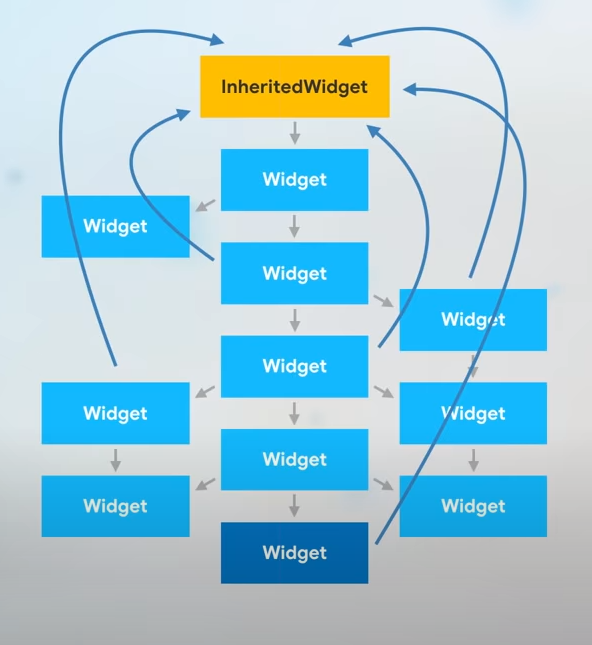

:memo: <span style="color:orange">FLUTTER_007_INHERITED_WIDGET_AND_PROVIDER</span>

# INHERITED WIDGET VÀ PROVIDER


## Table of Content

- [INHERITED WIDGET VÀ PROVIDER](#inherited-widget-và-provider)
  - [Table of Content](#table-of-content)
  - [I. Inherited Widget](#i-inherited-widget)
  - [II. Provider](#ii-provider)
    - [Provider builder and value constructors](#provider-builder-and-value-constructors)

## I. Inherited Widget

- Kỹ thuật truyền data từ widget cha xuống Widget con thông qua constructor được gọi là "Passing state down".
- Có 2 vấn đề xảy ra ở đây là:
  - Nếu khoảng cách giữa Widget cha và chắtchắt trên Widget tree càng xa thì chúng ta sẽ càng cực khổ để truyền được data qua constructor của nhiều Widget trung gian.
  - Khi Widget chacha gọi hàm setState, nó sẽ gọi lại hàm build khiến cho các Widget con đều được khởi tạo lại và gọi hàm build. Đây là 1 sự lãng phí vì ta chỉ cần widget chắtchắt được rebuild mà thôi.
- Làm thế nào để truyền data từ một widget cha nào đó xuống thẳng widget chắt mà không phải sử dụng constructor để truyền xuống từ từ từng widget một?

> InheritedWidget là một nơi lưu trữ data và cung cấp data cho widget con trong widget tree. Tất cả widget con của InheritedWidget đều có thể truy cập vào InheritedWidget để lấy data.

- Tức là từ vị trí InheritedWidget, không cần thiết phải truyền data xuống từng 1 widget con một nữa mà Widget con ở bất kỳ vị trí nào trên widget tree muốn lấy data từ InheritedWidget, đều có thể lấylấy data mà nó muốn từ InheritedWidget luôn.



- Cách hoạt động:
  - Bọc (Wrap) Cây Widget: TTạo một lớp kế thừa từ InheritedWidget và bọc nó lên trên cây widget chứa các widget con cần sử dụng dữ liệu.
  - Cung Cấp Dữ Liệu: Lớp InheritedWidget này sẽ lưu trữ dữ liệu và cung cấp phương thức tĩnh (of) để cho phép các widget con truy cập dữ liệu từ context.
  - Xác Định Khi Cần Rebuild: Phương thức updateShouldNotify được override để xác định xem khi dữ liệu thay đổi thì các widget con có cần được rebuild hay không.
- Ví dụ:

```dart
import 'package:flutter/material.dart';

// Hàm main() 
void main() {
  runApp(MyApp());
}

// Widget gốc của ứng dụng
class MyApp extends StatelessWidget {
  const MyApp({Key? key}) : super(key: key);

  @override
  Widget build(BuildContext context) {
    return MaterialApp(
      title: 'InheritedWidget Example',
      theme: ThemeData(
        primarySwatch: Colors.blue,
      ),
      home: HomePage(), // Gọi widget HomePage
    );
  }
}

// Lớp kế thừa từ InheritedWidget để chia sẻ dữ liệu counter
class CounterInheritedWidget extends InheritedWidget {
  final int counter; // Dữ liệu cần chia sẻ

  const CounterInheritedWidget({
    Key? key,
    required this.counter,
    required Widget child, // Đây là widget con mà InheritedWidget sẽ bọc lấy, để các widget con của nó có thể truy cập dữ liệu được chia sẻ.
  }) : super(key: key, child: child);

  // Phương thức static cho phép các widget con truy cập dữ liệu thông qua context
  static CounterInheritedWidget? of(BuildContext context) {
    // Giúp ta get được Widget cha gần vị trí context nhất có type là CounterInheritedWidget
    return context.dependOnInheritedWidgetOfExactType<CounterInheritedWidget>();
  }

  @override
  bool updateShouldNotify(CounterInheritedWidget oldWidget) {
    // Nếu giá trị counter thay đổi thì rebuild các widget con phụ thuộc
    return counter != oldWidget.counter;
  }
}

// Widget có trạng thái chứa counter và logic cập nhật
class HomePage extends StatefulWidget {
  const HomePage({Key? key}) : super(key: key);

  @override
  _HomePageState createState() => _HomePageState();
}

class _HomePageState extends State<HomePage> {
  int _counter = 0;

  void _incrementCounter() {
    setState(() {
      _counter++;
    });
  }

  @override
  Widget build(BuildContext context) {
    // Bọc Scaffold bằng CounterInheritedWidget để chia sẻ dữ liệu counter cho các widget con
    return CounterInheritedWidget(
      counter: _counter,
      child: Scaffold(
        appBar: AppBar(title: const Text("InheritedWidget Example")),
        body: Center(
          child: CounterDisplay(), // Widget hiển thị giá trị counter
        ),
        floatingActionButton: FloatingActionButton(
          onPressed: _incrementCounter,
          child: const Icon(Icons.add),
        ),
      ),
    );
  }
}

// Widget stateless sử dụng dữ liệu từ CounterInheritedWidget
class CounterDisplay extends StatelessWidget {
  const CounterDisplay({Key? key}) : super(key: key);

  @override
  Widget build(BuildContext context) {
    final inherited = CounterInheritedWidget.of(context);
    final counterValue = inherited?.counter ?? 0;

    return Text(
      "Counter: $counterValue",
      style: const TextStyle(fontSize: 24),
    );
  }
}
```

- Để tìm kiếm chúng ta sử dụng hàm context.dependOnInheritedWidgetOfExactType<CounterInheritedWidget>(); Nó sẽ giúp ta get được Widget cha gần vị trí context nhất có type là CounterInheritedWidget.
- Hàm updateShouldNotify được gọi ngay sau khi InheritedWidget bị rebuild. Nếu hàm updateShouldNotify return true thì một khi InheritedWidget rebuild, nó cũng bắt các widget con đang phụ thuộc vào nó phải rebuild. Ngược lại, nếu hàm updateShouldNotify return false thì nó sẽ không rebuild mấy thằng con phụ thuộc nó. Như thế nào được gọi là phụ thuộc?. Các widget con của MyInheritedWidget, nếu sử dụng hàm MyInheritedWidget.of(context) thì ta sẽ nói Widget đó sẽ phụ thuộc vào MyInheritedWidget.

- Ưu và Nhược Điểm:
  - Ưu điểm:
    - Tiết kiệm thời gian: Giảm việc phải truyền dữ liệu qua nhiều widget.
    - Tự động rebuild: Các widget con tự động rebuild khi dữ liệu thay đổi nếu được thiết lập đúng.
  - Nhược điểm:
    - Quản lý phức tạp: Khi ứng dụng có trạng thái phức tạp, việc sử dụng nhiều InheritedWidget lồng nhau có thể trở nên khó quản lý.
    - Cần kết hợp với StatefulWidget: InheritedWidget chỉ cung cấp cơ chế chia sẻ dữ liệu, không tự động cập nhật trạng thái.

- Để quản lý trạng thái phức tạp, có thể sử dụng các package sau dựa trên InheritedWidget:
  - Provider: Giúp quản lý trạng thái một cách dễ dàng và mở rộng từ InheritedWidget.
  - Riverpod: Là phiên bản cải tiến của Provider với nhiều tính năng mạnh mẽ.
  - Bloc/Cubit: Cung cấp kiến trúc quản lý trạng thái rõ ràng và có tổ chức hơn.

## II. Provider

> Provider là một package mạnh mẽ và được ưa chuộng trong Flutter để quản lý trạng thái (state management) và dependency injection. Nó được xây dựng dựa trên cơ chế của InheritedWidget nhưng cung cấp một cách tiếp cận đơn giản và linh hoạt hơn để chia sẻ dữ liệu giữa các widget trong ứng dụng.

- Để có thể sử dụng các package của provider cần thêm phần sau vào trong thư mục pubspec.yaml của project :

```yaml
dependencies:
  provider: ^5.0.0
```

- Các Loại Provider Thường Dùng:
  - Provider:
    - Cung cấp một đối tượng nào đó cho cây widget, không có cơ chế lắng nghe sự thay đổi.
  - ChangeNotifierProvider:
    - Dùng để cung cấp các đối tượng mở rộng từ ChangeNotifier.
    - Khi giá trị của đối tượng thay đổi (bằng cách gọi notifyListeners()), các widget con sử dụng đối tượng đó sẽ tự động rebuild.
  - FutureProvider:
    - Dùng để cung cấp dữ liệu bất đồng bộ từ một Future.
  - StreamProvider:
    - Dùng để cung cấp dữ liệu từ một Stream.
  - MultiProvider:
    - Cho phép bạn kết hợp nhiều Provider khác nhau trong cùng một cây widget, giúp code trở nên gọn gàng hơn.

- Để có thể cung cấp data model cho widget tree, cần bọc phần trên cùng của widget tree bằng một Provider. Với tham số truyền vào là data model vừa tạo. Trong widget tree để có thể tham chiếu đến data model, cần sử dụng Consumer widget để lấy ra data model vừa truyền vào ở trên.

- Không giống như Provider, ChangeNotifierProvider lắng nghe các thay đổi trong data model. Khi có thay đổi, nó sẽ xây dựng lại bất kỳ widget nào trong Consumer.
- Trong hàm build thay đổi Provider thành ChangeNotifierProvider. Lớp mô hình cần sử dụng extend ChangeNotifier (hoặc with ChangeNotifier). Điều này cung cấp cho bạn quyền truy cập vào notifyListeners() và bất kỳ lúc nào bạn gọi notifyListeners() thì ChangeNotifierProvider sẽ được thông báo và tất cả các widget bên trong Consumers sẽ được rebuild lại.

```dart
import 'package:flutter/material.dart';
import 'package:provider/provider.dart';

void main() => runApp(MyApp());

class MyApp extends StatelessWidget {
  @override
  Widget build(BuildContext context) {
    return ChangeNotifierProvider<MyModel>( //      <--- ChangeNotifierProvider
      create: (context) => MyModel(),
      child: MaterialApp(
        home: Scaffold(
          appBar: AppBar(title: Text('My App')),
          body: Row(
            mainAxisAlignment: MainAxisAlignment.center,
            children: <Widget>[
              Container(
                padding: const EdgeInsets.all(20),
                color: Colors.green[200],
                child: MyButton(), // Sử dụng MyButton
              ),
              Container(
                padding: const EdgeInsets.all(35),
                color: Colors.blue[200],
                child: Consumer<MyModel>( //                    <--- Consumer
                  builder: (context, myModel, child) {
                    return Text(myModel.someValue);
                  },
                ),
              ),
            ],
          ),
        ),
      ),
    );
  }
}

class MyModel with ChangeNotifier {
  String someValue = 'Hello';

  void doSomething() {
    someValue = 'Goodbye';
    print(someValue);
    notifyListeners();
  }
}

class MyButton extends StatelessWidget {
  @override
  Widget build(BuildContext context) {
    final myModel = Provider.of<MyModel>(context, listen: false);
    return ElevatedButton(
      child: Text('Do something'),
      onPressed: () {
        myModel.doSomething();
      },
    );
  }
}

```

- Notes:
  - Trong hầu hết các ứng dụng, Class Model của sẽ nằm trong package riêng của nó và sẽ cần phải import flutter/foundation.dart để sử dụng ChangeNotifier. Điều đó có nghĩa là Model có sự phụ thuộc vào framework.
  - Consumer widget sẽ xây dựng lại bất kỳ widget nào bên trong nó và bất cứ khi nào notifyListeners() được gọi. Tuy nhiên, button "Do something" không cần thiết phải cập nhật, vì vậy thay vì sử dụng Consumer, bạn có thể sử dụng Provider.of và set listener bằng false. Bằng cách đó, button "Do something" sẽ không được tạo lại khi có thay đổi.

- FutureProvider về cơ bản chỉ là một wrapper với bên trong là FutureBuilder. Có thể ccung cấp cho nó một số dữ liệu ban đầu để hiển thị trong giao diện người dùng và cũng có thể cung cấp cho nó một hoạt động bất đồng bộ Future của giá trị mà bạn muốn cung cấp. FutureProvider lắng nghe khi Future hoàn thành và sau đó thông báo cho Consumers để xây dựng lại các widget của nó.
- Notes:
  - FutureProvider yêu cầu Consumer xây dựng lại giao diện sau khi Future <Model> hoàn thành.
  - Lưu ý rằng việc nhấn nút “Do something” không cập nhật giao diện người dùng, ngay cả sau khi Future <Model> hoàn thành. Nếu muốn loại chức năng đó, thì chỉ cần sử dụng ChangeNotifierProvider.
  - Có thể sử dụng FutureProvider để đọc dữ liệu từ một file hoặc network. Nhưng bạn cũng có thể làm điều đó với FutureBuilder.

- StreamProvider về cơ bản là một wrapper với bên trong là một StreamBuilder. Có thểthể cung cấp một Stream và sau đó Consumer được xây dựng lại khi có sự kiện trong steam. Thiết lập rất giống với FutureProvider.
- StreamProvider không lắng nghe những thay đổi trong Model. Nó chỉ lắng nghe các sự kiện mới trong Steam.
- Notes:
  - StreamProvider yêu cầu Consumer xây dựng lại giao diện sau khi có sự kiện mới được phát ra.
  - Lưu ý rằng việc nhấn nút “Do something” sẽ không cập nhật giao diện người dùng. Nếu muốn loại chức năng đó, thì chỉ cần sử dụng ChangeNotifierProvider. Trên thực tế, có thể có một luồng trong đối tượng mô hình của mình và chỉ cần gọi notifyListeners(). Bạn hoàn toàn không cần StreamProvider trong trường hợp đó.

- Nó giống như ChangeNotifierProvider nhưng phức tạp hơn và không có bất kỳ giá trị gia tăng rõ ràng nào.

- Nếu cần cung cấp loại model object thứ hai, bạn có thể lồng các provider. Tuy nhiên, có một cách khác gọn gàng hơn là sử dụng MultiProvider.

```dart
import 'package:flutter/material.dart';
import 'package:provider/provider.dart';

void main() => runApp(MyApp());

class MyApp extends StatelessWidget {
  @override
  Widget build(BuildContext context) {
    return MultiProvider( //                                     <--- MultiProvider
      providers: [
        ChangeNotifierProvider<MyModel>(create: (context) => MyModel()),
        ChangeNotifierProvider<AnotherModel>(create: (context) => AnotherModel()),
      ],
      child: MaterialApp(
        home: Scaffold(
          appBar: AppBar(title: Text('My App')),
          body: Column(
            children: <Widget>[
              Row(
                mainAxisAlignment: MainAxisAlignment.center,
                children: <Widget>[

                  Container(
                      padding: const EdgeInsets.all(20),
                      color: Colors.green[200],
                      child: Consumer<MyModel>( //            <--- MyModel Consumer
                        builder: (context, myModel, child) {
                          return RaisedButton(
                            child: Text('Do something'),
                            onPressed: (){
                              // We have access to the model.
                              myModel.doSomething();
                            },
                          );
                        },
                      )
                  ),

                  Container(
                    padding: const EdgeInsets.all(35),
                    color: Colors.blue[200],
                    child: Consumer<MyModel>( //              <--- MyModel Consumer
                      builder: (context, myModel, child) {
                        return Text(myModel.someValue);
                      },
                    ),
                  ),

                ],
              ),

             // SizedBox(height: 5),

              Row(
                mainAxisAlignment: MainAxisAlignment.center,
                children: <Widget>[

                  Container(
                      padding: const EdgeInsets.all(20),
                      color: Colors.red[200],
                      child: Consumer<AnotherModel>( //      <--- AnotherModel Consumer
                        builder: (context, myModel, child) {
                          return RaisedButton(
                            child: Text('Do something'),
                            onPressed: (){
                              myModel.doSomething();
                            },
                          );
                        },
                      )
                  ),

                  Container(
                    padding: const EdgeInsets.all(35),
                    color: Colors.yellow[200],
                    child: Consumer<AnotherModel>( //        <--- AnotherModel Consumer
                      builder: (context, anotherModel, child) {
                        return Text('${anotherModel.someValue}');
                      },
                    ),
                  ),

                ],
              ),
            ],
          ),
        ),
      ),
    );

  }
}

class MyModel with ChangeNotifier { //                        <--- MyModel
  String someValue = 'Hello';
  void doSomething() {
    someValue = 'Goodbye';
    print(someValue);
    notifyListeners();
  }
}

class AnotherModel with ChangeNotifier { //                   <--- AnotherModel
  int someValue = 0;
  void doSomething() {
    someValue = 5;
    print(someValue);
    notifyListeners();
  }
}
```

- Nếu có hai Model mà muốn cung cấp, nhưng một trong các Model phụ thuộc vào mô hình còn lại. Trong trường hợp đó, có thể sử dụng ProxyProvider. ProxyProvider lấy giá trị từ một provider và cho phép nó được đưa vào provider khác.

```dart
import 'package:flutter/material.dart';
import 'package:provider/provider.dart';

void main() => runApp(MyApp());

class MyApp extends StatelessWidget {
  @override
  Widget build(BuildContext context) {
    return MultiProvider( //                              <--- MultiProvider
      providers: [
        ChangeNotifierProvider<MyModel>( //               <--- ChangeNotifierProvider
          create: (context) => MyModel(),
        ),
        ProxyProvider<MyModel, AnotherModel>( //          <--- ProxyProvider
          update: (context, myModel, anotherModel) => AnotherModel(myModel),
        ),
      ],
      child: MaterialApp(
        home: Scaffold(
          appBar: AppBar(title: Text('My App')),
          body: Column(
            children: <Widget>[
              Row(
                mainAxisAlignment: MainAxisAlignment.center,
                children: <Widget>[

                  Container(
                      padding: const EdgeInsets.all(20),
                      color: Colors.green[200],
                      child: Consumer<MyModel>( //          <--- MyModel Consumer
                        builder: (context, myModel, child) {
                          return RaisedButton(
                            child: Text('Do something'),
                            onPressed: (){
                              myModel.doSomething('Goodbye');
                            },
                          );
                        },
                      )
                  ),

                  Container(
                    padding: const EdgeInsets.all(35),
                    color: Colors.blue[200],
                    child: Consumer<MyModel>( //            <--- MyModel Consumer
                      builder: (context, myModel, child) {
                        return Text(myModel.someValue);
                      },
                    ),
                  ),

                ],
              ),

              Container(
                  padding: const EdgeInsets.all(20),
                  color: Colors.red[200],
                  child: Consumer<AnotherModel>( //          <--- AnotherModel Consumer
                    builder: (context, anotherModel, child) {
                      return RaisedButton(
                        child: Text('Do something else'),
                        onPressed: (){
                          anotherModel.doSomethingElse();
                        },
                      );
                    },
                  )
              ),

            ],
          ),
        ),
      ),
    );

  }
}

class MyModel with ChangeNotifier { //                       <--- MyModel
  String someValue = 'Hello';
  void doSomething(String value) {
    someValue = value;
    print(someValue);
    notifyListeners();
  }
}

class AnotherModel { //                                      <--- AnotherModel
  MyModel _myModel;
  AnotherModel(this._myModel);
  void doSomethingElse() {
    _myModel.doSomething('See you later');
    print('doing something else');
  }
}
```

### Provider builder and value constructors

- Hầu hết (nếu không phải tất cả) Provider có hai loại constructors. Hàm tạo cơ bản nhận một create trong đó bạn tạo đối tượng model của mình.

```dart
Provider<MyModel>(
  create: (context) => MyModel(),
  child: ...
)
```

- Nếu đối tượng của đã được tạo và bạn chỉ muốn cung cấp một tham chiếu đến nó, thì bạn có thể sử dụng value.

```dart
final myModel = MyModel();
...
Provider<MyModel>.value(
    value: myModel, 
    child: ...
)
```

- Ở đây MyModel đã được tạo trước đó và chỉ được chuyển vào dưới dạng tham chiếu. Bạn sẽ làm điều này nếu bạn đã khởi tạo model của mình trong phương thức initState(), và có thể gọi một phương thức đến model để tải data từ network.
