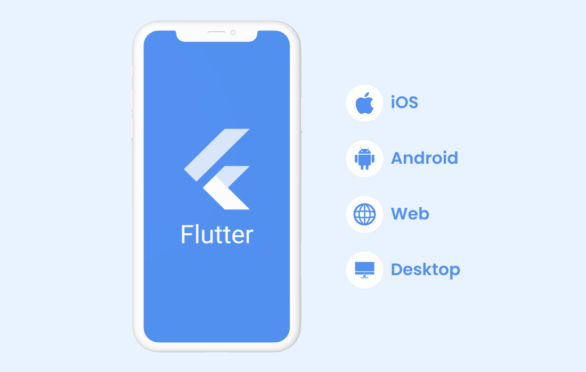

:memo: <span style="color:orange">FLUTTER_009_LOCAL_DATABASE</span>

# LOCAL DATABASE



## Table of Content

- [LOCAL DATABASE](#local-database)
  - [Table of Content](#table-of-content)
  - [Share preference](#share-preference)
  - [sqlite, hive, floor](#sqlite-hive-floor)
    - [sqlite](#sqlite)
    - [hive](#hive)
    - [floor](#floor)

## Share preference

> SharedPreferences là một cách để lưu trữ dữ liệu dưới dạng key - value trong ứng dụng Android và iOS.

- Lưu trữ dữ liệu dạng key-value
- Hỗ trợ các kiểu dữ liệu cơ bản như: bool, int, double, String và List<String>
- Dữ liệu được lưu trữ trong bộ nhớ nội bộ của thiết bị
- Dữ liệu vẫn còn sau khi đóng ứng dụng
- SharedPreferences có thể được sử dụng để lưu trữ dữ liệu người dùng, cài đặt hoặc bất kỳ dữ liệu nào cần truy cập nhanh chóng và hiệu quả giữa các phiên ứng dụng.

```yaml
dependencies:
  shared_preferences: ^2.2.2
```

```dart
flutter pub add shared_preferences

import 'package:shared_preferences/shared_preferences.dart';
```

- Ghi dữ liệu: Các kiểu dữ liệu được hỗ trợ là int, double, bool, String and List<String>.

```dart
final SharedPreferences prefs = await SharedPreferences.getInstance();

// Lưu 1 số nguyên(int) vào key 'counter'
await prefs.setInt('counter', 10);
// Lưu giá trị boolean vào key 'repeat'
await prefs.setBool('repeat', true);
// Lưu 1 số thực vào key 'decimal'
await prefs.setDouble('decimal', 1.5);
// Lưu 1 chuỗi vào key 'action'
await prefs.setString('action', 'Start');
// Lưu 1 list String vào key 'items'
await prefs.setStringList('items', <String>['Earth', 'Moon', 'Sun']);
```

- Lấy dữ liệu: Các kiểu dữ liệu được hỗ trợ là int, double, bool, String and List<String>.

```dart
// đọc dữ liệu từ key 'counter'. Nếu không tồn tại giá trị, trả về null
final int? counter = prefs.getInt('counter');

final bool? repeat = prefs.getBool('repeat');

final double? decimal = prefs.getDouble('decimal');

final String? action = prefs.getString('action');

final List<String>? items = prefs.getStringList('items');
```

- Xóa dữ liệu: Xóa dữ liệu tại key 'counter'

```dart
// xóa value của key 'counter'
await prefs.remove('counter');
```

- Kiểm tra có tồn gại giá trị không

```dart
bool CheckValue = prefs.containsKey('counter');
```

## sqlite, hive, floor

### sqlite

- CSDL quan hệ đầy đủ chức năng
- Hỗ trợ các truy vấn SQL phức tạp
- Phù hợp cho dữ liệu có cấu trúc và quan hệ

```yaml
dependencies:
  sqflite: ^2.3.0
  path: ^1.8.3
```

```dart
flutter pub add sqflite

import 'package:sqflite/sqflite.dart';
import 'package:path/path.dart';
```

- Tạo database:

```dart
import 'package:sqflite/sqflite.dart';
import 'package:path/path.dart';

class DatabaseHelper {
  static final DatabaseHelper _instance = DatabaseHelper._init();
  static Database? _database;


  DatabaseHelper._init();

  Future<Database> get database async {
    if (_database != null) return _database!;
    _database = await _initDatabase();
    return _database!;
  }

  Future<Database> _initDatabase() async {
    String path = join(await getDatabasesPath(), 'my_database.db');
    return await openDatabase(
      path,
      version: 1,
      onCreate: _createDb,
    );
  }

  Future<void> _createDb(Database db, int version) async {
    await db.execute('''
      CREATE TABLE users(
        id INTEGER PRIMARY KEY AUTOINCREMENT,
        name TEXT,
        email TEXT
      )
    ''');
  }

  Future<int> insertUser(Map<String, dynamic> row) async {
    Database db = await database;
    return await db.insert('users', row);
  }

  Future<List<Map<String, dynamic>>> getUsers() async {
    Database db = await database;
    return await db.query('users');
  }
}
```

### hive

> Hive là NoSQL key-value database được viết bằng Dart thuần, rất nhanh và hiệu quả.

- Không cần cấu hình SQL
- Rất nhanh (nhanh hơn SQLite trong nhiều trường hợp)
- Hỗ trợ lưu trữ đối tượng trực tiếp (với adapters)
- Nhẹ và dễ sử dụng

- Hive cho chúng ta lưu trữ dữ liệu dưới dạng một HiveObject, điều đó có nghĩa rằng chúng ta có thể sử dụng relation giữa các object với nhau. Dữ liệu được lưu trong một box, và bạn có thể viết một adapter để convert những data phức tạp như class, object để có thể lưu vào DB.

```yaml
dependencies:
  hive: ^2.2.3
  hive_flutter: ^1.1.0

dev_dependencies:
  hive_generator: ^2.0.1
  build_runner: ^2.4.6
```

- Tạo box:

```dart
var box = await Hive.openBox('testBox');
```

- Đọc ghi dữ liệu:

```dart
import 'package:hive/hive.dart';

void main() async {
    var box = await Hive.openBox('testBox');

    box.put('name', 'David');

    print('Name: ${box.get('name')}');
}
```

- Điều mà Hive trở nên nổi bật đó chính là việc tạo các adapter cũng có thể được thực hiện bằng code generation như đầu bài viết. Điều này sẽ giúp dữ liệu của bạn sẽ chặt chẽ hơn về Type, và giúp bạn lưu các loại data phức tạp.
- Document của Hive cũng hướng dẫn rõ cách tạo ra một box theo class mà bạn tự định nghĩa, ví dụ như:

```dart
import 'package:hive/hive.dart';

part 'person.g.dart';

@HiveType()
class Person {
    @HiveField(0) String name;
    @HiveField(1) int age;
    @HiveField(2) List<Person> friends;
}
```

- Class này chứa một List các Person, vì vậy Hive có thể tạo liên kết đến các object đó

### floor

> Floor là một wrapper cho SQLite, cung cấp một cách tiếp cận dựa trên DAO (Data Access Object) tương tự như Room trong Android.

- Tự động sinh code cho các thao tác CRUD
- Sử dụng Annotations để định nghĩa database
- Hỗ trợ reactive programming với Stream

```yaml
dependencies:
  floor: ^1.4.2
  sqflite: ^2.3.0

dev_dependencies:
  floor_generator: ^1.4.2
  build_runner: ^2.4.6
```

- Tạo database

```dart

@Database(version: 1, entities: [User])
abstract class AppDatabase extends FloorDatabase {
  UserDao get userDao;
}
```

- Đọc ghi dữ liệu:

```dart
import 'package:floor/floor.dart';

void main() async {
    final database = await $FloorAppDatabase.databaseBuilder('app_database.db').build();

    await database.userDao.insert(User(id: 1, name: 'David'));

    final user = await database.userDao.findById(1);

    print('Name: ${user.name}');
}
```

```dart
import 'package:floor/floor.dart';
import 'dart:async';
import 'package:sqflite/sqflite.dart' as sqflite;

part 'database.g.dart'; // Tự động sinh ra bởi floor_generator

@entity
class User {
  @PrimaryKey(autoGenerate: true)
  final int? id;
  
  final String name;
  final String email;
  
  User({this.id, required this.name, required this.email});
}

@dao
abstract class UserDao {
  @Query('SELECT * FROM User')
  Future<List<User>> findAllUsers();
  
  @Query('SELECT * FROM User WHERE id = :id')
  Future<User?> findUserById(int id);
  
  @insert
  Future<void> insertUser(User user);
  
  @delete
  Future<void> deleteUser(User user);
}

@Database(version: 1, entities: [User])
abstract class AppDatabase extends FloorDatabase {
  UserDao get userDao;
}

// Khởi tạo Database
Future<AppDatabase> buildDatabase() async {
  return await $FloorAppDatabase.databaseBuilder('app_database.db').build();
}
```
